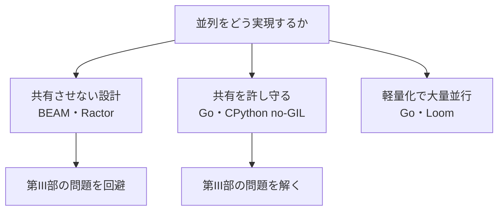

# ケーススタディ横断：5 つの処理系

最終章では、本書で積み上げた概念が、現実の処理系でどう具現化しているかを横断的に振り返ります。取り上げるのは Go ランタイム、Erlang/Elixir の BEAM、Java の仮想スレッド（Project Loom）、Ruby の GVL から Ractor への歩み、そして CPython の no-GIL です。同じ問題に対して、各処理系が異なるトレードオフ（第17章で挙げた「正しさ・単一スレッド性能・並列性能・互換性」の四者）をどう取ったかを比べることで、本書全体を立体的に見直します。

## Go ランタイム：CSP と work-stealing の実装

Go は、本書の第II部の多くを、言語とランタイムの中核として実装した好例です。

- **並行モデル**：CSP（第3章[CSPの原論文](#cite:hoare1978)）。`goroutine`（軽量スレッド）と `channel`、`select` を言語の第一級機能にしている。
- **軽量スレッド**：goroutine は可変サイズの小さなスタックを持ち、数百万作れる（第11章）。
- **スケジューラ**：M:N スケジューリングと work-stealing（第11章[work-stealingの論文](#cite:blumofe1999)）。OS スレッド（M）の上で goroutine（G）を、プロセッサ（P）を介して走らせる「GMP モデル」。ブロックする操作は横取りされ、OS スレッドを遊ばせない。
- **GC**：並行 GC（第14章）。write barrier を使い、停止時間を極小（典型的にサブミリ秒）に抑えることに注力している。
- **共有モデル**：「メモリを共有して通信するな、通信してメモリを共有せよ」を標語に掲げるが、共有メモリ自体は許す。Go のレースは起こりうるので、標準で race detector（第19章[ThreadSanitizerの論文](#cite:serebryany2009) と同系統）を同梱している点が実践的。

Go の教訓は、**第II部の機能群（CSP・軽量スレッド・work-stealing・並行 GC）を最初から統合設計すると、これだけ素直に並列が書ける** ということです。後付けではなく設計段階から並列を前提にした強みが出ています。

## Erlang/Elixir の BEAM：隔離による堅牢性

BEAM は Erlang/Elixir の仮想マシンで、アクターモデル（第3・9章[アクターモデルの原論文](#cite:hewitt1973)）を最も徹底した処理系です。Joe Armstrong の学位論文[Armstrongの学位論文](#cite:armstrong2003) の思想がそのまま実装されています。

- **隔離**：Erlang のプロセス（アクター）は完全に隔離され、メモリを一切共有しない（第18章）。各プロセスが自分のヒープを持ち、メッセージは値のコピーで渡される。
- **GC**：プロセスごとに独立した小さなヒープを GC する。共有しないので、あるプロセスの GC が他を止めない——隔離が GC の並行化（第14章）を自然に解いている。
- **スケジューラ**：軽量プロセスを M:N で走らせ、各プロセスに実行時間の予算（reduction count）を与えてプリエンプトする。協調任せでない公平なスケジューリング。
- **障害モデル**：「Let it crash」。プロセスが落ちても隔離されているので波及せず、監視ツリー（supervisor）が再起動する。並列性そのものより **隔離による堅牢性** が主眼。

BEAM の教訓は、**第18章の「共有させない」を設計の根本に据えると、第III部の問題（共有状態・GC の並行化）の多くが最初から発生しない** ということです。代償は、すべてがメッセージのコピーになることと、共有メモリ的な細粒度の最適化ができないことです。

## Java 仮想スレッド（Project Loom）：互換性を守る軽量化

Java は長く OS スレッドに 1:1 対応する重いスレッドを使ってきました。Project Loom の **仮想スレッド（virtual threads）**[JEP 444](#cite:jep444) は、これを後付けで軽量化した、互換性重視の設計の好例です。

- **軽量スレッド**：仮想スレッドは JDK が管理する軽量スレッドで、既存の `Thread` API をそのまま使える（第11章）。ブロックすると、それを載せていたキャリア（OS スレッド）は解放され、別の仮想スレッドを走らせる。
- **スケジューラ**：デフォルトで `ForkJoinPool` を使い、work-stealing（第11章[Cilk-5の論文](#cite:frigo1998) と同系統）で負荷をならす。
- **設計判断**：第11章で触れた「ファイバー方式（スタック退避）」を選び、`async`/`await` 方式の "function coloring" を避けた。だから既存の同期的なコード（ブロッキング I/O を使うライブラリ）が、書き換えなしに軽量化の恩恵を受けられる。
- **TLS の教訓**：第6章で触れたとおり、TLS が大量の仮想スレッドで問題になるため、scoped values という別機構が導入された。

Loom の教訓は、**膨大な既存資産（同期的なコードとライブラリ）を壊さずに大量並行を実現するには、ファイバー方式の軽量スレッドが有効** ということです。互換性という制約が設計を決めた例です。

## Ruby：GVL から Ractor へ

Ruby は、本書の第III部と第17章の物語を地で行く処理系です。長く GVL（第17章）の下で、単一スレッド性能と C 拡張の安全性を保ってきました。

- **GVL 時代**：一度に 1 スレッドしか Ruby コードを実行できない。I/O では GVL を解放するので並行は活きるが、CPU バウンドは並列化できない（第17章）。
- **Ractor**[Ractorのドキュメント](#cite:ractor2020)：第17・18章で見た「隔離インスタンス」の道。Ractor ごとに GVL を持ち、Ractor 間でオブジェクトを共有させない（共有できるのは深く凍結された不変オブジェクトなどに限る）。隔離により、第III部の共有状態問題を「発生させない」ことで並列実行を実現した。
- **設計判断**：BEAM 的な隔離を、既存の Ruby に後付けで導入した。完全な free-threading（後述の Python の道）より、互換性と安全性を優先したトレードオフ。
- **コピーと所有権移動**：Ractor 間のメッセージは、コピーするか所有権を移すか（第18章）を選べる。move したオブジェクトに元の Ractor が触るとエラーになる。

Ruby の教訓は、**後付けで並列化する処理系にとって、「全部を free-threading にする」より「隔離した単位を並列に走らせる」方が、互換性を保ちつつ並列性を得る現実的な道になりうる** ということです。代償は、隔離の制約をユーザが受け入れる必要があることです。

## CPython no-GIL：借金を正面から返す

CPython の no-GIL 化[PEP 703](#cite:pep703) は、第17章で述べた「GVL という借金を、正面から一括返済する」最大の事例です。

- **目標**：GIL を外し、1 プロセス内で複数スレッドが Python コードを真に並列実行できるようにする。しかも単一スレッド性能を落とさず、既存の C 拡張をできるだけ壊さずに。
- **参照カウント**（第16章）：CPython は参照カウント方式の GC を使う。これを atomic 化する重い代償を、バイアス付き参照カウント・不変オブジェクトの恒久化（immortalization）・遅延カウントで緩和した。
- **内部の共有状態**（第13〜15章）：辞書・リスト・集合などの組み込み型に細粒度のロックを入れ、メモリアロケータやインターン表を thread-safe 化した。まさに第III部の課題を一つずつ潰す作業。
- **互換性**：free-threaded ビルドを当初オプション扱いとし、段階的に展開する慎重な進め方を取った。

no-GIL の教訓は、**GVL を外すとは、第13〜17章で見たすべての借金を一度に返すことに他ならない** という、本書の構図そのものです。提案から安定化まで長い年月を要していること自体が、その借金の大きさを物語っています。

## 横断比較：四者のトレードオフ

5 つの処理系を、第17章で挙げた四者のトレードオフで並べてみます。

| 処理系 | 並行モデル | 並列の実現方法 | 共有の扱い | 重視した点 |
|--------|-----------|----------------|-----------|-----------|
| Go | CSP | M:N＋work-stealing、最初から並列前提 | 共有可・race detector で補助 | 統合設計・書きやすさ |
| BEAM | アクター | 隔離プロセスを M:N | 共有しない（コピー） | 隔離・堅牢性 |
| Java/Loom | スレッド | ファイバー＋ForkJoinPool | 共有メモリ＋既存同期 | 既存資産の互換性 |
| Ruby/Ractor | アクター的 | Ractor ごとの GVL | 隔離（不変は共有可・move 可） | 後付け互換性＋安全 |
| CPython no-GIL | スレッド | GIL 除去＋細粒度ロック | 共有メモリ（ロックで保護） | 既存意味論の維持 |

この表が示すのは、**唯一の正解は無い** ということです。「最初から並列前提で統合設計する（Go）」「共有させない（BEAM・Ractor）」「既存資産を守りつつ軽量化する（Loom）」「借金を正面から返す（CPython）」——どれも、置かれた制約（新規か既存か、互換性の重さ、ユーザ層）の下での合理的な選択です。第17章で述べたとおり、正しさ・単一スレッド性能・並列性能・互換性の四者は同時には満たせず、何を捨てるかが処理系の個性になります。

## おわりに

本書は、並行と並列の区別（第1章）から始まり、ハードウェア・モデル・メモリモデル（第2〜4章）という土台の上に、データ競合を体験し（第5章）、スレッドから同期、ロックフリー、メッセージパッシング、軽量スレッド、データ並列という言語機能を載せ（第6〜12章）、処理系内部の共有状態・GC・キャッシュ・参照カウント・GVL・共有モデルを点検し（第13〜18章）、最後に検証・評価と実例（第19〜21章）へとたどり着きました。

全体を貫く原則は、繰り返し現れた次の一文に尽きます。**最良の同期は、同期しなくて済むように設計を変えること**。共有を減らし、不変にし、隔離し、型で守る——競合は、起きてから直すより、起きないように設計する方がはるかに良いのです。

> [!TIP]
> ここからの一歩として、第5章の Tiny VM を実際に拡張してみることを勧めます。スレッドを足し（第6章）、ロックで守り（第7章）、Ractor 的に隔離し（第18章）、ThreadSanitizer にかけ（第19章）、Amdahl の法則で測る（第20章）——本書の各章を、自分の手の中の小さな処理系で追体験することが、最も確実な理解への道です。そしてより深く学ぶには、本書が引用した原典——メモリモデル[Java メモリモデル](#cite:manson2005)、wait-free 同期[Herlihy のwait-free論文](#cite:herlihy1991)、GC ハンドブック[GC ハンドブック](#cite:jones2011) など——にあたってください。並列処理系の世界は、ここからが本番です。
