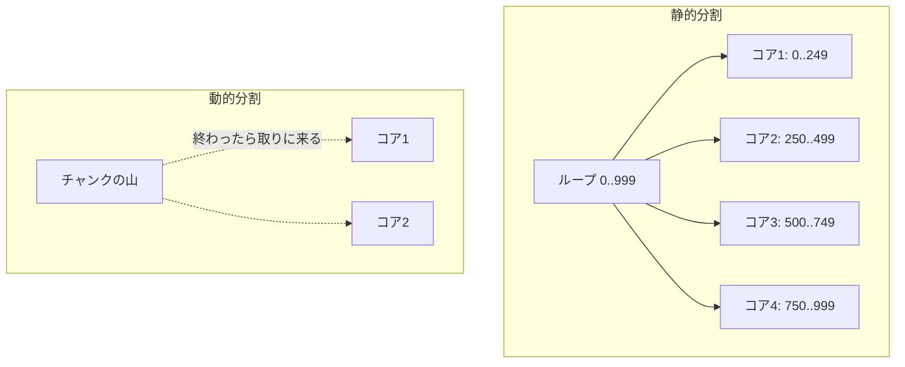
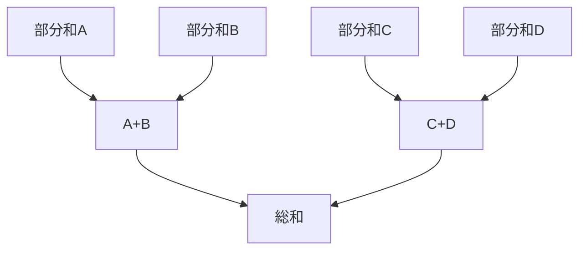

# データ並列：並列ループと map/reduce

第10章までで扱ったのは、互いに異なる仕事を並行に進める **タスク並列** でした。本章はもう一方の軸、**データ並列（data parallelism）**——同じ処理を大量のデータに一斉に適用する並列性——を扱います。データ並列は、規則的で大規模な計算において、最も素直に並列性能を引き出せる形であり、言語に並列機能を載せるうえで「ユーザに最も歓迎されやすい」入り口でもあります。

## なぜデータ並列は扱いやすいのか

第5章では、共有状態を素朴に並列化して痛い目を見ました。データ並列が比較的安全なのは、典型的なケースで **各データ要素の処理が互いに独立** だからです。配列の各要素を 2 乗する処理を考えると、要素 `i` の計算は要素 `j` の計算と何も共有しません。独立なら、データを分割して別々のコアに配るだけで、同期をほとんど気にせず並列化できます。

```ruby
# 逐次版
result = data.map { |x| heavy(x) }

# データ並列版（イメージ）: 同じ処理を分割して並列に適用
result = data.parallel_map { |x| heavy(x) }
```

「各要素の処理が独立で、副作用がない（純粋関数）」という条件が満たされる限り、データ並列は驚くほど素直に動きます。逆に言えば、本章の落とし穴はほぼすべて「この独立性の仮定が崩れたとき」に集約されます。

## 並列ループ：処理系はどう分割するか

最も基本的なデータ並列が **並列ループ（parallel loop）** です。「このループの各反復は独立だから、好きに分割して並列に回してよい」とユーザが宣言し、処理系がそれを複数コアに割り振ります。処理系の実装者にとっての設計判断は、主に **分割の粒度** と **負荷の偏り** です。

ループを N 個のコアに分けるとき、単純に「前から N 等分」する **静的分割（static scheduling）** が最も軽量です。分割のオーバーヘッドがほぼゼロだからです。しかし各反復の処理時間がばらつくと、重い反復が偏ったコアだけ遅れ、他が遊ぶ「負荷の偏り（load imbalance）」が起きます。

これを避けるのが **動的分割（dynamic scheduling）** です。ループを小さなチャンクに刻み、各コアが「終わったら次のチャンクを取りに来る」方式にします。負荷は自然にならされますが、チャンクを配る同期のコストが乗ります。両者の中間として、最初は大きく、残りが減るにつれチャンクを小さくする **guided scheduling** もよく使われます。



> [!NOTE]
> この「動的にチャンクを配る」発想は、第10章の work-stealing[work-stealing の論文](#cite:blumofe1999) と地続きです。並列ループを「各チャンクを 1 タスクとして work-stealing スケジューラに流し込む」と実装すれば、タスク並列の基盤をそのままデータ並列に再利用できます。多くの現代ランタイム（Java の parallel stream、Cilk[Cilk-5 の論文](#cite:frigo1998)、各種並列ライブラリ）はこの方針です。

## reduce：独立でない集約をどう並列化するか

`map` は各要素が独立なので素直でした。難しいのは **reduce（畳み込み）**——多数の要素を 1 つの値に集約する操作です。合計、最大値、ヒストグラムの統合などがこれにあたります。集約は「結果」を共有するので、素朴に並列化すると第5章の lost update に逆戻りします。

並列 reduce の鍵は **結合律（associativity）** です。演算 `⊕` が結合的（`(a⊕b)⊕c == a⊕(b⊕c)`）であれば、計算の「まとめる順序」を自由に変えられます。これにより、各コアが自分の担当範囲を部分集約し、最後にその部分結果同士をまとめる、という木構造の並列化ができます。

```ruby
# 各コアが部分和を出し（共有なし）、最後に部分和をまとめる
def parallel_sum(data, n_workers)
  chunks = data.each_slice(data.size / n_workers).to_a
  partials = chunks.map do |chunk|
    Thread.new { chunk.sum }   # 各スレッドは自分のローカルな部分和だけ計算
  end.map(&:value)
  partials.sum                  # 部分和をまとめる（ここは小さい）
end
```

ポイントは、**各ワーカが共有変数を更新せず、自分専用の部分結果（partial）を持つ** ことです。共有カウンタを全員が atomic に叩く設計より、はるかにスケールします（第19章でこの差を実測の観点から再訪します）。これは「共有を減らすほど速くなる」という、本書を貫く原則の一例です。



> [!WARNING]
> 並列 reduce は結合律を前提にしますが、浮動小数点の加算は厳密には結合的ではありません（丸め誤差のため `(a+b)+c` と `a+(b+c)` が一致しないことがある）。そのため並列化すると逐次版と結果がわずかに変わり得ます。これはバグではなく原理的な性質です。ユーザにデータ並列を提供する処理系は、この「並列だと結果が微妙に変わりうる」ことをドキュメントで明示すべきです。

## map/reduce というパターン

`map`（各要素を独立に変換）と `reduce`（結合的に集約）を組み合わせた **map/reduce** は、データ並列の最も汎用的な骨格です。「独立に変換 → 局所的に集約 → 集約結果を統合」という三段構えは、1 台のマルチコアから、何千台ものクラスタ（分散 MapReduce）まで、同じ形でスケールします。言語に `parallel_map` と `parallel_reduce` を用意することは、ユーザに「独立性と結合律を意識させる」という教育的な効果も持ちます。

## データ並列が壊れるとき

データ並列の安全性は「各要素の処理が独立」という仮定に全面的に依存しています。この仮定が崩れる典型を挙げます。

- **隠れた共有状態**：`map` のブロックの中で、外側のカウンタやキャッシュ、ログバッファを更新している。見た目は独立でも、実は共有を踏んでいる。
- **要素間の依存**：要素 `i` の計算が要素 `i-1` の結果に依存する（漸化式、累積和の素朴な実装など）。これは単純には並列化できず、scan（並列プレフィックススキャン）のような専用アルゴリズムが要る。
- **副作用の順序依存**：`map` のブロックが I/O やグローバル状態を変更し、その順序に意味がある場合。並列化で順序が崩れる。

> [!CAUTION]
> 「`map` だから安全」ではありません。安全なのは「**純粋（副作用がなく、外を共有しない）な** `map`」だけです。処理系がデータ並列 API を提供するとき、ブロックが純粋であることはユーザの責任になります。第18章のデータ競合検出ツールは、こうした「隠れた共有」を見つける強力な助けになります。

## SIMD・GPU との接続

第2章で触れた SIMD と GPU は、データ並列の最も先鋭な実行基盤です。並列ループの本体が「各要素に同じ単純な演算をする」形なら、コンパイラはそれを SIMD 命令へ自動ベクトル化でき、さらに規模が大きく規則的なら GPU カーネルへ載せられます。言語処理系から見ると、データ並列は「マルチコアへの分割」と「コア内 SIMD」と「GPU への委譲」という三層の並列性に、同じプログラムから接続できる入り口になります。本書ではこれ以上は踏み込みませんが、データ並列が単一の抽象から複数のハードウェア並列性へ橋渡しする位置にあることは押さえておいてください。

## 第II部のまとめ

これで第II部——ユーザに見える並列機能——が一通り揃いました。

- スレッドと同期（第6〜7章）：共有メモリ並列の基礎。
- ロックフリー（第8章）：進行保証を高める発展手法。
- メッセージパッシング（第9章）：共有しないことで競合を避ける。
- 軽量スレッドとスケジューラ（第10章）：大量並行の土台。
- データ並列（本章）：規則的計算を素直に並列化する。

しかし、ここまでの機能をユーザに提供しても、処理系はまだ並列実行に耐えられません。なぜなら、処理系自身の内部にも、第5章の `@globals` や `@stack` に相当する共有状態が無数にあるからです。第III部では、その「一見並列と無関係に見える」内部を一つひとつ点検し、並列実行に耐えるよう作り直していきます。
