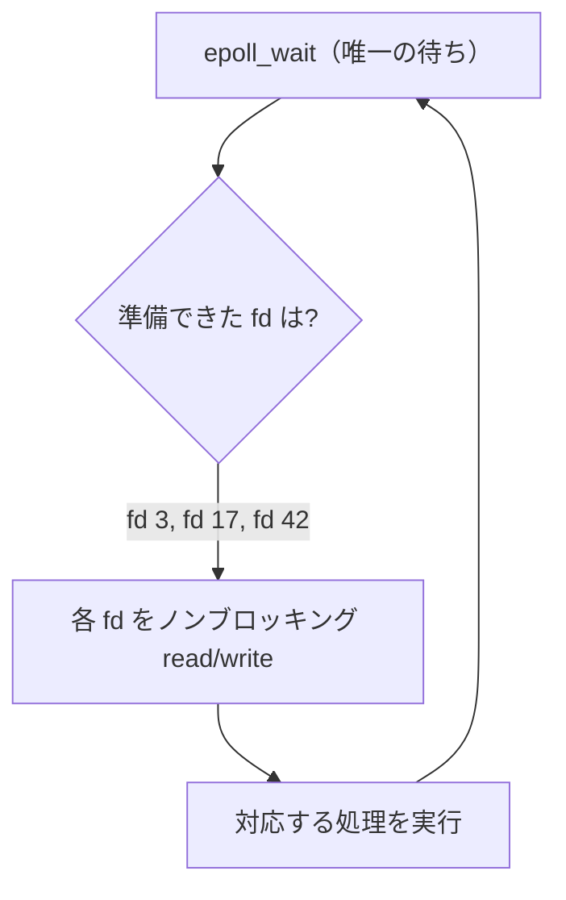
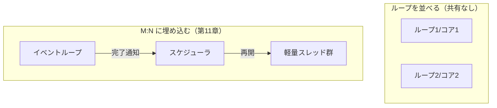

# イベントループと非同期 I/O

前章までのスレッドやチャネルは、「複数の仕事を**同時に走らせる**」ための道具でした。しかし並行（concurrency）の動機は、コアを増やして速くすることだけではありません。Web サーバのように **何万もの接続を同時に待ち受ける** 仕事では、ほとんどの時間は「ネットワークからの返事を待っているだけ」で、CPU はほぼ遊んでいます。こういう **I/O バウンド** な並行は、コアをたくさん使うのではなく、**1 つの実行主体で多数の待ちを捌く** ことで解けます。第1章で「並行はあるが並列はない」と述べた、その代表的な実装がこの章の主題——**イベントループ（event loop）** と **非同期 I/O** です。

## スレッド・パー・接続はなぜ破綻するのか

素朴な並行サーバは、接続が来るたびにスレッドを 1 本作ります（**thread-per-connection**）。各スレッドは自分の接続に対して同期的に `read`/`write` し、ブロックする間は寝ているだけ——書くのは簡単です。第6章で見たとおり、これは接続数が数百までなら何の問題もありません。

問題は数が増えたときです。1 接続 1 スレッドだと、1 万接続で 1 万スレッドが要ります。第6章で触れたように OS スレッドは数 MB のスタックを占め、切り替えはカーネルを経由して重い。1 万スレッドのうち実際に動いているのはごく一部で、残りはすべて「`read` でブロックして寝ているだけ」なのに、メモリとスケジューラの負荷だけは人数分かかります。この「接続が 1 万に達するとサーバが破綻する」問題は、Dan Kegel が **C10K 問題**[C10K問題](#cite:kegel2006)として広く知らしめました。

発想を変えましょう。寝ているスレッドが大量に要るのは、**「待ち」を 1 本のスレッドに 1 つずつ割り当てている** からです。もし「どの接続が読めるようになったか」をまとめて 1 か所で監視できれば、待ちのためにスレッドを増やす必要はなくなります。

## I/O 多重化：複数の待ちを 1 か所で監視する

その「まとめて監視する」仕組みが、OS が提供する **I/O 多重化（I/O multiplexing）** です。多数のファイル記述子（ソケットなど）を OS に預け、「このうちどれかが読み書き可能になったら教えてくれ」と頼みます。歴史的には `select`/`poll`、現代では Linux の `epoll`、BSD/macOS の `kqueue`、Windows の IOCP が使われます。

ここで決定的に重要なのが、**ノンブロッキング（non-blocking）I/O** との組み合わせです。ソケットをノンブロッキングモードにすると、`read` はデータがなくても寝ずに即座に「いまは無い（`EWOULDBLOCK`）」と返ります。つまり手順はこうなります。

1. OS に「監視したい記述子の集合」を預ける。
2. 「どれか準備できるまで待つ」とだけブロックする（`epoll_wait` など、ここが唯一の待ち地点）。
3. 準備できた記述子の一覧が返るので、それらだけをノンブロッキングに読み書きする。



`select`/`poll` は毎回すべての記述子を OS へ渡し直し、線形に走査するので、監視対象が増えると 1 回の呼び出しが重くなります（O(n)）。`epoll`/`kqueue` は監視集合をカーネル側に常駐させ、「変化があったものだけ」を返すので、10 万接続でも準備できた一握りだけを受け取れます。C10K を超えてスケールできたのは、この O(1) 寄りの通知機構が普及したからです。

> [!NOTE]
> 「準備できたか教える（readiness）」方式（`epoll`/`kqueue`）と、「完了したら教える（completion）」方式（Windows IOCP、Linux の `io_uring`）は別物です。前者は「読めるようになった、さあ自分で読め」、後者は「頼んでおいた読み込みが**もう終わった**、バッファに入っている」と通知します。前者を **リアクタ（Reactor）**、後者を **プロアクタ（Proactor）** と呼びます。本章は普及した Reactor 方式を中心に説明します。

## リアクタパターンとイベントループ

I/O 多重化を中核に据えた設計が、Schmidt がまとめた **リアクタパターン（Reactor）**[Reactorパターン](#cite:schmidt1995)です。骨格は驚くほど単純で、「準備できたイベントを待ち、対応するハンドラへ振り分ける」ループ——すなわち **イベントループ** を回し続けるだけです。

```ruby
class EventLoop
  def initialize
    @selector = Selector.new       # epoll/kqueue の薄いラッパ
    @handlers = {}                  # fd -> 準備できたときに呼ぶ処理
    @timers   = TimerQueue.new      # 「N 秒後に呼ぶ」予約
  end

  def on_readable(io, &block)
    @selector.register(io, :read)
    @handlers[io] = block
  end

  def run
    until @handlers.empty? && @timers.empty?
      timeout = @timers.next_deadline       # 次のタイマーまで
      ready = @selector.wait(timeout)       # ★唯一のブロック地点
      @timers.fire_expired                  # 期限切れタイマーを実行
      ready.each do |io|
        @handlers[io].call(io)              # 準備できた fd のハンドラを呼ぶ
      end
    end
  end
end
```

このループはずっと **1 スレッド** で回ります。それでも、`@selector.wait` で同時に何万もの記述子を監視できるので、何万もの接続を 1 スレッドで並行に捌けます。スレッドを増やさずに並行を得る——これが「並列を伴わない並行」の正体です。Node.js、nginx、Redis、Python の `asyncio` は、いずれもこの 1 スレッドのイベントループを心臓に持ちます。

> [!IMPORTANT]
> イベントループの鉄則は **「ハンドラの中でブロックするな、長居するな」** です。ループは 1 スレッドなので、あるハンドラが同期的なファイル読み込みや重い計算で 100ms 居座ると、その 100ms の間、**他のすべての接続が固まります**。第1章の言葉で言えば、協調的スケジューリングにおける「制御を手放さない 1 人」が全体を止めるのです。だからこの世界では、すべての I/O がノンブロッキングでなければならず、重い CPU 処理は後述の手段で外へ追い出す必要があります。

タイマーも同じループに統一的に組み込める点に注目してください。「N 秒後に実行」は、`@selector.wait` のタイムアウト値を「次に期限が来るタイマーまでの時間」に設定するだけで実現できます。前章の `select` でタイムアウトをチャネルとして扱えたのと同じ発想で、**待ち（I/O・タイマー・シグナル）をすべて 1 つのループに集約** するのがイベント駆動設計の要諦です。

## コールバックから async/await へ

イベントループの素朴な API は **コールバック** です。「読めたらこれを呼べ」と関数を登録する。ところが、I/O が連鎖すると（接続を受ける → リクエストを読む → DB に問い合わせる → 返事を書く）、コールバックが入れ子になり、いわゆる **コールバック地獄** に陥ります。

```ruby
listen(port) do |conn|
  conn.read do |req|
    db.query(req) do |rows|
      conn.write(render(rows)) do
        conn.close
      end
    end
  end
end
```

これを平坦化する第一歩が、第9章で見た **future/promise** でした。「結果が出たら次へ」を `then` でつなげば、入れ子は鎖になります。そして「結果が出るまでこの関数を中断する」を構文に昇華したのが、次章で扱う **`async`/`await`** です。`await` は、内部的には「いまの実行を中断してイベントループへ制御を返し、待っている I/O が完了したらこの続きを再スケジュールする」操作にほかなりません。

```ruby
async def handle(conn)
  req  = await conn.read      # 読めるまで中断 → ループは他の接続を処理
  rows = await db.query(req)  # 返事が来るまで中断
  await conn.write(render(rows))
  conn.close
end
```

見た目は同期的（thread-per-connection と同じ素直さ）でありながら、`await` のたびに制御がイベントループへ戻るので、1 スレッドで多数の接続を並行に進められます。**「同期的に読めるコード」と「1 スレッドでの高並行」を両立させる** ——これがイベントループ＋`async`/`await` が広く採用された理由です。処理系実装者から見れば、`async` 関数は第11章で述べるステートマシンへ変換され、その「次の状態へ進める」トリガをイベントループの完了通知が担う、という分業になります。

## 1 コアの壁と、多コアへの広げ方

イベントループの弱点は、その美点の裏返しです。**1 スレッドで回る以上、1 コア分の CPU しか使えません。** I/O バウンドなら問題ありませんが、ハンドラの中に重い計算（CPU バウンド）が混じると、その間ループ全体が止まります。広げ方は大きく 2 つあります。

1 つめは、**イベントループを CPU コアの数だけ並べる** ことです。コアごとに独立したループを 1 スレッドずつ走らせ、接続を各ループへ振り分けます。Linux の `SO_REUSEPORT`（同じポートを複数プロセスで待ち受け、カーネルが接続を分配する）や、Node.js の cluster、nginx のワーカプロセスがこの方式です。各ループは独立なので共有状態がなく、第III部で苦しむ並列化の問題の多くを**そもそも持ち込まない**——これは隔離（第18章）の発想に通じます。

2 つめは、**イベントループを軽量スレッドのランタイムに埋め込む** ことです。第11章の M:N スケジューラは、軽量スレッドがブロックする I/O を、内部でノンブロッキング I/O ＋イベントループに変換します。ユーザは `await` すら書かず素朴に同期的なコードを書くだけで、ランタイムが裏でイベントループを回し、ブロックした軽量スレッドを脇に退け、I/O が完了したら再開させます。Go のランタイムや Java の仮想スレッド（第21章）が採るこの道は、「イベントループの高並行」と「同期的コードの素直さ」を、`async` の色（第11章）すら見せずに統合します。重い CPU 処理は、別のワーカスレッドへ追い出す（スレッドプールにオフロードする）ことで、ループを止めずに処理します。



> [!TIP]
> Linux の `io_uring` は、Reactor（準備通知）から Proactor（完了通知）へと舞台を移しつつあります。読み書きの要求を **リングバッファ** に積んでおき、完了したものをまとめて回収するので、システムコールの往復すら削れます。イベントループの「唯一の待ち地点」は残りますが、その 1 回でより多くの I/O を片付けられる——高並行ランタイムの土台は、いまも OS と二人三脚で進化しています。

## 本章のまとめ

- I/O バウンドな並行は、コアを増やすのではなく **1 つの実行主体で多数の待ちを捌く** ことで解ける。これが「並列を伴わない並行」の典型である。
- thread-per-connection は接続数に比例してスレッドが要り、C10K で破綻する。鍵は **I/O 多重化（`epoll`/`kqueue`）＋ノンブロッキング I/O** で、待ちを 1 か所に集約することにある。
- **リアクタパターン**＝イベントループは、「準備できたイベントを待ち、ハンドラへ振り分ける」単純なループを 1 スレッドで回す。I/O もタイマーも 1 つのループに統一できる。
- ループの鉄則は「ブロックするな、長居するな」。コールバック地獄は future（第9章）と `async`/`await`（第11章）で平坦化する。
- 1 スレッドゆえ 1 コアしか使えない。多コアへは、**ループをコア数だけ並べる**（隔離・第18章）か、**M:N ランタイムに埋め込む**（第11章）かで広げる。

イベントループは「ブロックする操作を、実際には OS スレッドをブロックさせないものに置き換える」ランタイムの土台です。次章では、この土台の上に **軽量スレッドとスケジューラ** を組み上げ、ユーザには同期的に見える大量並行を実現します。
