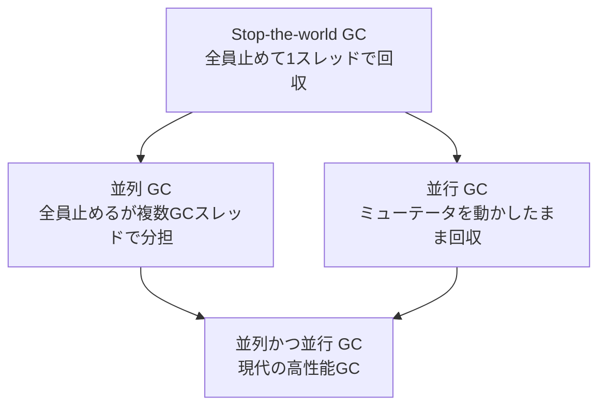

# メモリ管理と GC

オブジェクトの確保と回収は、処理系で最も頻繁に行われる操作です。だからこそ、メモリ管理は並列化において最大の難所になります。アロケータは全スレッドが叩く共有資源であり、ガベージコレクタ（GC）はヒープ全体——すなわち全スレッドが触るオブジェクト——を相手にするからです。本章では、アロケータの競合、Stop-the-world から並行・並列 GC への発展、write barrier、そして `false sharing` を扱います。体系的な詳細は GC ハンドブック[](#cite:jones2011)が決定版です。

## アロケータの競合

オブジェクトを確保するたびに、アロケータは「空き領域のどこを使うか」を管理する内部構造を更新します。これが単一のグローバルなフリーリストだと、全スレッドの確保がそこに殺到し、ロック競合の巨大なボトルネックになります。オブジェクトを多用する言語では、確保は秒間に数百万回起こりえます。そこを 1 個のロックで直列化したら、コアを増やすほど競合が悪化しかねません。

定石は **スレッドローカルなアロケータ** です。各スレッドに専用の小さな割り当て領域（thread-local allocation buffer, TLAB などと呼ばれる）を渡し、その中での確保はロックなしの単純なポインタ加算で済ませます。バッファを使い切ったときだけ、グローバルなヒープからまとめて補充する（このときだけ同期する）のです。第6章の TLS と同じ発想——「共有しないことが最速の同期」——が、アロケータの心臓部に効いています。

```ruby
# 概念図：スレッドローカルなバンプアロケータ
class ThreadLocalAllocator
  def initialize(global_heap)
    @global = global_heap
    @top = @limit = nil   # 自分専用の領域
  end

  def alloc(size)
    if @top.nil? || @top + size > @limit
      @top, @limit = @global.fetch_chunk   # ここだけグローバルと同期
    end
    addr = @top
    @top += size           # 普段はポインタを進めるだけ。ロック不要
    addr
  end
end
```

## Stop-the-world GC とその限界

GC の最も単純な実装は **Stop-the-world（STW）** です。GC を始めるとき、すべてのアプリケーションスレッド（ミューテータと呼ぶ）を安全な地点で完全に停止させ、誰も動いていない静止状態でヒープを走査・回収し、終わったら全員を再開させます。

この「安全な地点」を **セーフポイント（safepoint）** と呼びます。任意の機械語命令の途中で止めると、レジスタやスタックが中途半端な状態で、GC がルート（生きている参照の出発点）を正しく見つけられません。そこで各スレッドは、ループの戻りや関数呼び出しなどに埋め込まれたチェックでセーフポイントに「自分から立ち寄り」、そこで止まります。第11章の軽量スレッドを持つランタイムでは、GC は全ファイバーのスタックも走査できなければならず、ファイバーの切り替え点が自然なセーフポイントになります。スケジューラと GC は、この停止機構を介して密接に絡み合っているのです。

STW の利点は実装の単純さです。GC 中はヒープが変化しないので、「いまどのオブジェクトが生きているか」を競合を気にせず判定できます。逐次処理系の GC は、ほぼ例外なく STW です。

問題は **停止時間（pause time）** です。ヒープが大きくなるほど、全スレッドを止める時間が伸びます。対話的なアプリやサーバでは、この「全員が固まる」時間が応答性を直撃します。さらに並列処理系では、STW のたびに全コアが遊ぶので、せっかくの並列性が GC のたびに帳消しになります。

```mermaid
gantt
    title Stop-the-world GC（全スレッドが GC 中に停止）
    dateFormat X
    axisFormat %s
    section ミューテータ1
        実行 :0, 3
        停止(GC) :crit, 3, 5
        実行 :5, 8
    section ミューテータ2
        実行 :0, 3
        停止(GC) :crit, 3, 5
        実行 :5, 8
    section GCスレッド
        回収作業 :active, 3, 5
```



## 並列 GC と並行 GC

STW を改善する方向は 2 つあり、混同されがちなので用語を厳密に区別します。

- **並列 GC（parallel GC）**：STW で全員を止めるのは同じだが、**GC 作業そのものを複数の GC スレッドで分担** して、停止時間を短くする。止めること自体は変えず、止まっている時間を縮める。
- **並行 GC（concurrent GC）**：**ミューテータを動かしたまま GC を進める**。停止時間を限りなく小さくする（あるいは無くす）。最も難しい。



並行 GC が難しいのは、**GC がヒープを走査している最中に、ミューテータがそのヒープを書き換えてしまう** からです。GC が「このオブジェクトはもう誰からも参照されていない、回収しよう」と判断した直後に、ミューテータが生きているオブジェクトからそのオブジェクトへの参照を作ったら、生きているオブジェクトを誤って回収してしまいます（use-after-free）。動いている対象を数えながら回収する——走っている列車の車輪を数えるような難しさです。Doligez と Leroy による ML 向けの並行・世代別 GC[](#cite:doligez1993) は、この問題に正面から取り組んだ先駆的な研究です。

## write barrier：GC とミューテータの協調

並行 GC（および世代別 GC）の要が **write barrier（書き込みバリア）** です。これは「オブジェクトの参照フィールドを書き換えるたびに、GC に小さな通知を入れる」仕掛けです。第4章のメモリバリアとは別概念なので注意してください（名前が紛らわしいですが、こちらは GC のための記録です）。

考え方はこうです。GC が走査済みのオブジェクトに、ミューテータが未走査オブジェクトへの新しい参照を書き込むと、GC はその参照を見逃しかねません。そこで参照を書き込む箇所すべてに「いま新しい参照を張ったよ」と GC に記録させるコードを挿入します。GC はその記録を頼りに、見逃しそうなオブジェクトを再走査します。

```ruby
# 概念図：参照を書き込むたびにバリアを通す
def write_field(obj, field, new_value)
  obj.send("#{field}=", new_value)
  write_barrier(obj, new_value)   # GC へ「参照が変わった」と通知
end
```

write barrier は **すべての参照書き込みに乗る** ので、その実装の軽さが処理系全体の性能を左右します。重い barrier は、GC の停止時間を減らした分を、平常時のスローダウンで食い潰してしまいます。「平常時のオーバーヘッド」と「停止時間」のトレードオフが、GC 設計の中心的な緊張関係です。

> [!IMPORTANT]
> 逐次処理系から並行 GC へ移行するとき、write barrier の挿入漏れは最悪のバグを生みます。「ほとんどの場合は動くが、ごく稀に生きているオブジェクトが消える」——再現困難で、原因の特定が極めて難しい。処理系のすべての参照書き込み経路（C 拡張からの書き込みを含む）を漏れなくバリアで覆うことが、並行 GC を入れる際の最重要事項です。

## false sharing：GC とアロケータに潜む性能の罠

最後に、正しさではなく **性能** の罠を扱います。第2章で触れた **false sharing（偽共有）** です。キャッシュは 64 バイト程度のキャッシュライン単位で動くので、別々のスレッドが更新する別々の変数が、たまたま同じキャッシュラインに同居すると、ハードウェアがそのラインを互いに奪い合い、激しく性能が落ちます。

GC とアロケータは false sharing の温床です。たとえば、各スレッドの確保カウンタや GC 統計を配列にまとめて置くと、隣り合う要素が同じラインに乗り、スレッドごとの更新が衝突します。対策は **パディング（padding）**——意図的に隙間を空けて、各スレッドが触るデータを別々のキャッシュラインに分離することです。

```ruby
# 各スレッドの統計を、キャッシュライン境界に合わせて分離する（イメージ）
class PerThreadStats
  # 1要素を64バイト境界にアラインし、隣同士が同じラインに乗らないようにする
  # （実際の処理系では構造体のアラインメント指定や手動パディングで行う）
end
```

false sharing は、ソースを読んでも「共有していない」ので見つけにくく、プロファイラ（第20章）でキャッシュミスを測って初めて気づくことが多い罠です。並列化したのに思ったほど速くならないとき、まず疑うべき容疑者のひとつです。

## 本章のまとめ

- アロケータはスレッドローカルバッファで競合を避けるのが定石。「共有しない確保」が高速。
- STW GC は単純だが、全スレッドを止めるため並列性と応答性を損なう。
- 並列 GC（止めて分担）と並行 GC（止めずに回収）は別概念。後者が最も難しい。
- 並行 GC は write barrier でミューテータと協調する。平常時コストと停止時間のトレードオフが核心。
- false sharing は GC・アロケータの統計などに潜む性能の罠。パディングで分離する。

次章では、処理系の速度を支えるもうひとつの仕掛け——**各種キャッシュと遅延初期化** が、並列化でどう壊れるかを扱います。GC と同じく「速くするための仕掛けが、共有された可変状態である」という構図が再び現れます。
