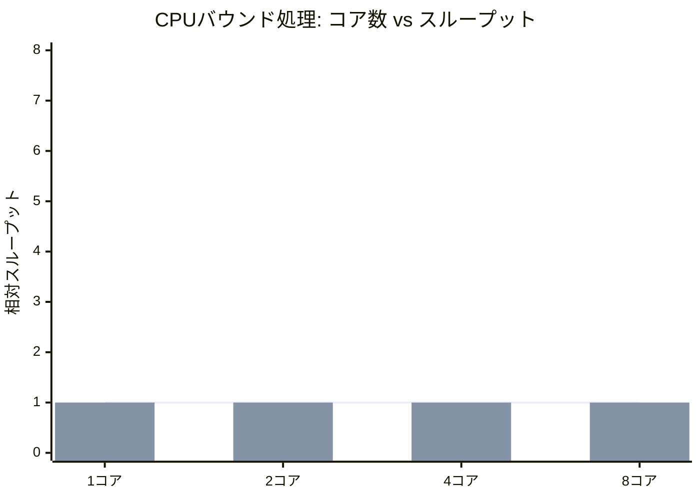
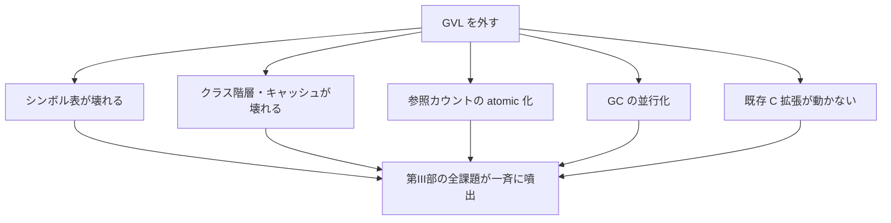

# GIL/GVL という「逃げ」とその代償

第III部でここまで見てきたのは、処理系内部に潜む膨大な共有状態——シンボル表、クラス階層、GC、各種キャッシュ、参照カウント——が、並列化でどれも壊れる、という事実でした。これらを一つひとつ正しく作り直すのは、気の遠くなる作業です。そこで多くの処理系が選んだのが、**たった 1 個の巨大なロックで全部まとめて守る** という選択でした。それが **GIL/GVL** です。本章は第III部の山場として、この「逃げ」の正体と代償を物語ります。

## GIL/GVL とは何か

**GIL（Global Interpreter Lock）** あるいは **GVL（Giant VM Lock / Global VM Lock）** は、「処理系の中で、一度に 1 つのスレッドしか Ruby/Python コードを実行できない」ようにする、プロセス全体で 1 個の大きなロックです。CPython の GIL、CRuby の GVL が代表例です（呼び名は違いますが本質は同じなので、本章では GVL と総称します）。

第5章の最後で、Tiny VM 全体を 1 つの `Monitor` で囲って正しくした例を思い出してください。GVL はまさにあれの処理系全体版です。スレッドはコードを実行する前に GVL を取得し、実行を終える（あるいは一定間隔で譲る）と解放します。

```ruby
# GVL の概念（実際は処理系の C 実装の中にある）
def run_bytecode(thread)
  acquire_gvl   # ここを通れるのは一度に1スレッドだけ
  begin
    # バイトコードを実行（この間、他スレッドは Ruby コードを実行できない）
  ensure
    release_gvl
  end
end
```

```mermaid
gantt
    title GVL があるときの実行（コード実行は常に1スレッド）
    dateFormat X
    axisFormat %s
    section スレッド1
        実行(GVL保持) :0, 2
        待ち :crit, 2, 4
        実行(GVL保持) :4, 6
    section スレッド2
        待ち :crit, 0, 2
        実行(GVL保持) :2, 4
        待ち :crit, 4, 6
```



## なぜ GVL は「うまい逃げ」なのか

GVL には、見過ごせない実利があります。

第一に、**第III部の問題がすべて消えます**。一度に 1 スレッドしかコードを実行しないので、シンボル表もクラス階層もキャッシュも参照カウントも、同時に 2 スレッドから触られることがありません。第13〜16章で苦労した共有状態を、まったく作り直さずに済むのです。

第二に、**単一スレッド性能が落ちません**。参照カウント（第16章）を atomic にする必要がないので、逐次実行は GVL なしと同じ速度で走ります。ロックの取得・解放のコストは、スレッドが 1 本ならほぼ無視できます。

第三に、**C 拡張が安全に書けます**。Ruby も Python も、C で書かれた拡張ライブラリの巨大な生態系を持ちます。それらの C コードは「自分が動いている間、処理系の状態は誰も触らない」という GVL の保証に暗黙に依存しています。GVL は、無数の既存 C 拡張を並行性の悪夢から守る防波堤でもあるのです。

第四に、**I/O では並行性が活きます**。多くの処理系は、ブロックする I/O やスリープの間は GVL を解放します。だから「複数スレッドでファイルを読む・ネットワークを待つ」ようなワークロードでは、GVL があっても並行に進めます。GVL が並列性を奪うのは、あくまで **CPU を使う計算** の部分です。

> [!NOTE]
> 「GVL があると Ruby のスレッドは無意味」というのは誤解です。GVL を解放する I/O 待ちが多いワークロード（多くの Web アプリがそう）では、マルチスレッドは十分に有効です。GVL が壁になるのは、複数スレッドで CPU 計算を並列化したいとき——まさに第1章で述べたマルチコア時代の中心的な要求——です。

## GVL の代償

利点が大きいぶん、代償も大きい。最大の代償は明白です。**CPU バウンドな計算が、コアを増やしても速くならない**。8 コアあっても、Ruby/Python コードを実行できるのは常に 1 スレッドだけだからです。第1章で述べた「マルチコアで速くしたい」という根本的な動機に、GVL は真っ向から反します。



上の図のように、GVL 下では CPU バウンド処理のスループットはコアを増やしても横ばいです。これは第20章で扱う Amdahl の法則[](#cite:amdahl1967) の極端な形——並列化できる割合が実質ゼロ——と見なせます。

さらに、GVL は **公平性とレイテンシ** の問題も抱えます。GVL を握ったスレッドがいつ手放すか、待っているスレッドにどう渡すか、というスケジューリングが難しい。手放しが遅いと他スレッドが飢え、頻繁すぎると切り替えコストがかさみます。CRuby はタイマースレッドで GVL の保持時間を制限するなど、地道な調整を重ねてきました。

## 「外すと第III部が全部問題化する」

ここが本章の核心であり、本書全体の構図を映す物語です。GVL は第III部の問題を「隠して」いただけで、「解決して」はいません。GVL を外そうとした瞬間、第13〜16章で見た問題が **一斉に・すべて** 顔を出します。

- シンボル表・インターン（第13章）→ 並行アクセスで破壊される
- クラス階層・定数表（第13章）→ 探索中の組み替えで壊れる
- メソッド／インラインキャッシュ（第15章）→ 無効化が競合する
- 遅延初期化（第15章）→ 二重初期化・未初期化観測
- GC（第14章）→ 並行・並列 GC への作り直し、write barrier
- 参照カウント（第16章）→ atomic 化の重い代償
- 無数の C 拡張 → GVL の暗黙の保証を失い、書き直しが必要



つまり GVL とは、第III部全体を「あとで払う」と先送りにした借金のようなものです。借りている間は快適ですが、外す（返す）ときに利息ごと一括で請求されます。Python の no-GIL 化[](#cite:pep703) が、提案から実装、安定化まで何年もの大仕事になっているのは、この借金の大きさそのものです。

## GVL を外す道、外さない道

処理系がこの借金とどう向き合うかには、いくつかの道があります。

1. **GVL を外す（free-threading）**：第III部の全課題を正面から解く。CPython の no-GIL[](#cite:pep703) がこの道。互換性（特に C 拡張）の維持が最大の難所。
2. **複数プロセスで回避する**：プロセスを分ければアドレス空間が別なので共有状態の問題がない。ただしプロセス間通信とメモリ二重持ちのコストがかかる（Python の `multiprocessing`、Ruby の多プロセス Web サーバ）。
3. **隔離された複数の処理系インスタンス**：1 プロセス内に、状態を共有しない複数の「ミニ処理系」を持ち、それぞれが自分の GVL を持つ。Ruby の Ractor[](#cite:ractor2020) がこの道で、GVL は「Ractor ごと」になります。共有しないことで第III部の問題を回避しつつ、1 プロセス内で並列実行する——第18章のオブジェクト共有モデルへ直結します。

> [!IMPORTANT]
> どの道にも一長一短があります。free-threading は究極の自由度を得る代わりに膨大な作り直しと互換性リスクを負い、多プロセスは安全だがメモリと通信のコストを払い、Ractor 方式は安全と並列を両立する代わりにオブジェクト共有を厳しく制限します。「正しさ」「単一スレッド性能」「並列性能」「既存資産との互換性」の四者は、同時にはすべて満たせません。GVL を巡る議論は、突き詰めればこの四者のトレードオフをどう取るかの議論です。

## 本章のまとめ

- GVL は「一度に 1 スレッドしかコードを実行できない」大きな 1 個のロック。第III部の共有状態問題を一括で回避する。
- 利点：内部の作り直し不要、単一スレッド性能を保つ、C 拡張が安全、I/O では並行できる。
- 代償：CPU バウンド処理がコア数で速くならない（Amdahl の極端形）、公平性・レイテンシの調整が難しい。
- GVL を外すと、第13〜16章の問題が一斉に噴出する。GVL は第III部を先送りした「借金」。
- 向き合い方は free-threading・多プロセス・隔離インスタンス（Ractor）の 3 つ。四者のトレードオフがある。

最後の「隔離インスタンス」という道——共有させないことで安全と並列を両立する——は、第III部の締めくくりにふさわしい発想です。次章では、この **オブジェクト共有モデル**（隔離・コピー・所有権・型による保護）を体系的に扱います。
