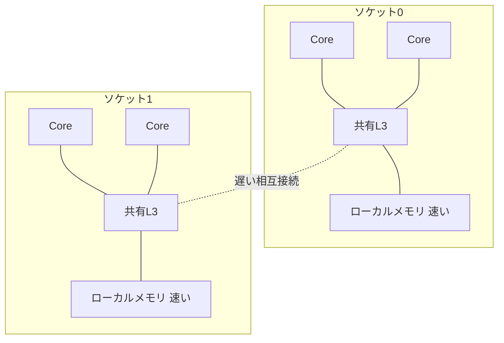

# ハードウェアの前提

並列処理系を設計するうえで、ハードウェアの性質を完全に無視することはできません。並列実行の **正しさ**（同期がなぜ必要か）も **性能**（並列化したのに速くならない理由）も、その多くがハードウェアの構造から来ているからです。本章では、言語処理系の実装者として最低限知っておきたいハードウェアの前提を、深入りしすぎない範囲で概観します。

## メモリ階層とキャッシュ

現代の計算機で最も重要な事実のひとつは、**CPU はメモリよりもはるかに速い** ということです。CPU が 1 命令を実行する時間に対して、主記憶（DRAM）へのアクセスは 100 倍以上かかることも珍しくありません。この速度差を埋めるのが **キャッシュ（cache）** です。

キャッシュは CPU に近い、小さくて速いメモリです。よく階層化されており、L1（最速・最小）、L2、L3（最大・最も遅い、多くの場合コア間で共有）と段階的に大きく遅くなります。

| 階層 | 容量の目安 | アクセスの目安 |
|------|-----------|---------------|
| レジスタ | 数百バイト | 即時 |
| L1 キャッシュ | 数十 KB | 数サイクル |
| L2 キャッシュ | 数百 KB〜数 MB | 十数サイクル |
| L3 キャッシュ | 数 MB〜数十 MB | 数十サイクル |
| 主記憶（DRAM） | 数 GB〜 | 数百サイクル |

> [!IMPORTANT]
> キャッシュはバイト単位ではなく **キャッシュライン（cache line）** という固定サイズ（典型的には 64 バイト）の単位でメモリを出し入れします。この事実は並列性能に直結します。別々のスレッドが、たまたま同じキャッシュラインに乗った別々の変数を更新すると、ハードウェアはその 1 本のラインを互いに奪い合い、性能が激しく落ちます。これを **false sharing（偽共有）** と呼び、第13章と第19章で詳しく扱います。

### キャッシュコヒーレンシ

各コアが自前のキャッシュを持つと、「コア A のキャッシュにある値」と「コア B のキャッシュにある値」が食い違う恐れがあります。これを防ぐのが **キャッシュコヒーレンシ（cache coherence）** プロトコル（MESI など）です。あるコアがある変数を書き換えると、他のコアのキャッシュにある同じラインのコピーは無効化されます。

コヒーレンシのおかげで「最終的には」みなが同じ値を見ます。しかし注意してほしいのは、**コヒーレンシは個々の変数の一貫性を保証するだけで、複数の変数にまたがる操作の順序までは保証しない** という点です。「いつ他のコアの書き込みが見えるか」「複数の書き込みがどんな順序で見えるか」は、次章以降で扱うメモリモデルの問題として残ります。

## マルチコアと NUMA

複数のコアがメモリをどう共有するかには、大きく 2 つの構成があります。

- **UMA（Uniform Memory Access）**：すべてのコアが、どのメモリ番地にも同じコストでアクセスできる構成。
- **NUMA（Non-Uniform Memory Access、非対称メモリアクセス）**：コア（やソケット）ごとに「近いメモリ」と「遠いメモリ」がある構成。近いメモリは速く、遠いメモリ（別ソケットに繋がったメモリ）は遅くなります。

大規模なサーバは NUMA であることがほとんどです。NUMA 環境では、「どのスレッドが、どのコアで動き、どのメモリを使うか」が性能を大きく左右します。処理系の実装者にとっては、スレッドのスケジューリング（第10章）やメモリアロケータ（第13章）の設計で、データを使うコアの近くに確保する（first-touch ポリシーなど）配慮が効いてきます。

## SIMD：1 命令で複数データ

並列性にはコアをまたぐものだけでなく、1 コアの中の並列性もあります。**SIMD（Single Instruction, Multiple Data）** は、1 つの命令で複数のデータに同じ演算を適用する仕組みです。たとえば「4 つの浮動小数点数を一度に足す」命令があれば、ループの 4 反復分を 1 命令で処理できます。x86 の SSE/AVX、ARM の NEON/SVE などがこれにあたります。

SIMD はデータ並列（第11章）と相性がよく、配列に対する一様な計算を大幅に高速化します。言語処理系から見ると、SIMD の活用は主にコンパイラの自動ベクトル化や、明示的なベクトル型・組み込み関数の提供という形で現れます。本書では深入りしませんが、「コア数を増やす並列化」とは別軸の並列性が CPU 内部にも存在することは押さえておいてください。

## GPU：大量のスレッドで押し切る

**GPU（Graphics Processing Unit）** は、もともと画像処理のために、単純な演算を膨大なデータに並列適用する用途で発展しました。CPU が「少数の賢いコア」だとすれば、GPU は「大量の単純なコア」です。数千の実行レーンが、同じプログラム（カーネル）を異なるデータに対して一斉に実行します。

GPU は SIMD をさらに推し進めた **SIMT（Single Instruction, Multiple Threads）** という実行モデルを採り、行列演算や深層学習のような規則的・大規模なデータ並列計算で圧倒的な性能を出します。一方で、条件分岐が多い・データアクセスが不規則・スレッド間で複雑に同期するといった処理は苦手です。汎用言語の処理系が GPU を直接の実行基盤にすることは稀で、多くは CUDA/OpenCL/SYCL のような専用の枠組みや、ライブラリ経由で利用します。本書ではこれ以上は踏み込みませんが、「並列実行の基盤は CPU コアだけではない」という地図の一部として覚えておいてください。

## なぜこれが処理系設計に効くのか

本章の内容は、後の章で繰り返し効いてきます。

- キャッシュとコヒーレンシ → なぜ同期（メモリバリア）が必要か（第4・7章）、false sharing（第13・19章）
- NUMA → スケジューラとアロケータの設計（第10・13章）
- SIMD・GPU → データ並列の実装（第11章）

> [!NOTE]
> ここで重要なのは、ハードウェアの細部を暗記することではなく、「メモリは一様でも瞬時でもない」「CPU はあなたの書いた順序どおりにメモリを触るとは限らない」という感覚を持つことです。次章では、この上に並行・並列を記述するためのプログラミングモデルの地図を描きます。
