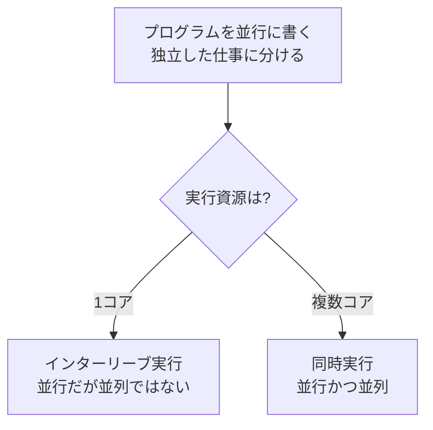

# 導入：並行と並列、そしてなぜ今なのか

本書の主題は「プログラミング言語の処理系に並列実行の機能を載せる」ことです。しかしその前に、私たちが扱おうとしている対象——並行（concurrency）と並列（parallelism）——を正確に区別しておく必要があります。この 2 つは日常語ではほとんど同義に使われますが、処理系を設計するうえでは決定的に異なる概念だからです。

## 並行と並列は別の概念である

**並行（concurrency）** とは、複数の処理を「同時に進行中の状態として扱う」ことです。実際に同じ瞬間に動いている必要はありません。1 つの CPU コアしかなくても、OS が高速に切り替えれば、ユーザから見れば複数の仕事が同時に進んでいるように見えます。並行は **プログラムの構造** に関する概念——独立した複数の仕事をどう分けて記述し、どう調停するか——です。

**並列（parallelism）** とは、複数の処理が「物理的に同じ瞬間に実行される」ことです。これには複数の実行資源（CPU コア、ベクトル演算器、GPU など）が必要です。並列は **実行（ハードウェアの使い方）** に関する概念です。

Go の設計者 Rob Pike の有名な言い方を借りれば、「並行は仕事を構造化する方法であり、並列はその実行のされ方」です。次の図はこの関係を整理したものです。

重要なのは、**並行に書かれたプログラムだけが並列に実行できる** という点です。逐次的に（1 本の道筋として）書かれたプログラムは、いくらコアを増やしても勝手には速くなりません。プログラムを独立した仕事へ分割する——すなわち並行に構造化する——ことが、並列実行の前提になります。本書で「言語に並列機能を載せる」と言うとき、その実態の多くは「ユーザが並行性を表現でき、処理系がそれを並列に実行できるようにする」ことです。

> [!NOTE]
> 並行はあるが並列はない、という状況は珍しくありません。たとえば JavaScript のイベントループは高度に並行ですが、JavaScript のコード自体は基本的に 1 スレッドで走るため並列ではありません。逆に、SIMD 命令によるベクトル演算は並列ですが、プログラムの構造としては逐次的（1 本のループ）に見えることがあります。

## なぜ今、並列化が避けられないのか

並列化が処理系設計の中心課題になったのは、ハードウェアの歴史的な転換が理由です。

**ムーアの法則** は「集積回路上のトランジスタ数が約 2 年ごとに倍増する」という経験則で、これ自体は長く成り立ってきました。問題はもう一つの経験則、**デナードスケーリング（Dennard scaling）** の終焉です。デナードスケーリングは「トランジスタを小さくすると、単位面積あたりの消費電力が一定に保たれる」という性質で、これが成り立っていた間は、トランジスタの微細化に合わせてクロック周波数を上げても消費電力と発熱が抑えられました。

2000 年代半ば、リーク電流の増大によりデナードスケーリングが崩れ、クロック周波数をこれ以上上げると発熱が手に負えなくなる「パワーウォール（power wall）」に突き当たりました。その結果、増え続けるトランジスタの使い道は「1 コアを速くする」ことから「コアを増やす」ことへと舵を切ります。これが Herb Sutter の言う「フリーランチの終わり」[「The Free Lunch Is Over」](#cite:sutter2005)です。それまでは何もしなくてもクロック向上で勝手にソフトが速くなっていた（フリーランチ）のが、これからはソフト側が並列性を引き出さなければ性能が伸びなくなった、という宣言でした。

この帰結は、言語処理系の作り手にとって重い意味を持ちます。**ユーザのプログラムが速くなるかどうかが、処理系が並列実行をどれだけうまく支えられるかにかかってくる** からです。

## 並列化で何が変わるのか——処理系実装者の視点

逐次的な処理系を作るのは、難しくはあっても見通しのよい仕事です。プログラムカウンタは 1 つ、状態の変化は一直線、ある時点でのプログラムの状態は一意に定まります。バグがあれば、同じ入力で同じように再現します。

並列化はこの前提をすべて壊します。

- **状態が一意でなくなる**：複数のスレッドが同時に進むと、「いまプログラムはどの状態か」を一意に言えなくなります。実行のたびに、命令の絡み合い（インターリーブ）が変わります。
- **再現性が失われる**：あるインターリーブでだけ起きるバグは、デバッガを当てた瞬間にタイミングが変わって消える（いわゆるハイゼンバグ）ことがあります。
- **「素朴に共有する」と壊れる**：複数スレッドが同期なしに同じメモリを読み書きすると、結果は未定義になります。これを **データ競合（data race）** と呼びます。第4章と第5章でその実体を詳しく見ます。
- **内部状態も危険になる**：ユーザコードだけでなく、処理系自身が持つ内部状態（後述するシンボル表や GC、各種キャッシュ）も、複数スレッドから触られると壊れます。これが第III部の主題です。

つまり並列化とは、単に「スレッドを作る API を足す」ことではありません。処理系全体を、複数の実行主体が同時に存在する世界に耐えられるよう作り直す営みです。

## 本書の地図

本書は 4 部構成です。

1. **第I部（基礎）**：並行・並列の概念、ハードウェア、各種モデル、メモリモデル、そしてデータ競合を体験する極小インタプリタ。
2. **第II部（言語機能）**：スレッド、同期プリミティブ、ロックフリー、メッセージパッシング、軽量スレッド、データ並列。ユーザに見える機能の設計と実装。
3. **第III部（内部）**：共有状態の棚卸し、GC、キャッシュ、参照カウント、GIL／GVL、オブジェクト共有モデル。一見並列と無関係に見える箇所の作り直し。
4. **第IV部（検証・評価）**：データ競合検出、性能評価、そして実在処理系のケーススタディ。

サンプルは主に Ruby で示します。Ruby 自身が、長く単一スレッド前提（GVL あり）で作られた処理系を、Ractor[Ractor のドキュメント](#cite:ractor2020)によって後から並列化していった経緯を持つため、本書の問題意識と相性がよいからです。

> [!TIP]
> 本書を読み進める間、「これは並行の話か、並列の話か」「いま誰が（どのスレッドが）この状態を触りうるか」を常に自問してください。この 2 つの問いが、並列処理系のほとんどすべての設計判断の出発点になります。

次章では、私たちのコードが最終的に走るハードウェア——メモリ階層、キャッシュ、NUMA、SIMD、GPU——の前提を概観します。並列実行の正しさと性能は、どちらもハードウェアの性質に強く縛られているからです。
