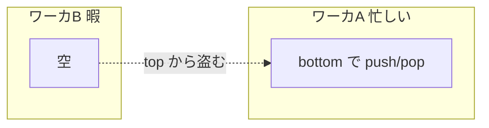

# 軽量スレッドとスケジューラ

第6章で見たとおり、OS スレッドは固定サイズのスタックを持ち、数万も作れません。しかし第9章のチャネルやアクターは、数十万・数百万の実行主体が当たり前のように欲しくなります。このギャップを埋めるのが **軽量スレッド（lightweight thread）** です。本章では、ファイバー、M:N スケジューリング、work-stealing、`async`/`await`、構造化並行性という、現代の並行ランタイムの中核を組み立てます。

## なぜ OS スレッドでは足りないのか

OS スレッドの問題を整理します。第一に **メモリ**：1 スレッドあたり数 MB のスタックは、数万スレッドで破綻します。第二に **切り替えコスト**：OS スレッドの切り替えはカーネルを経由し、レジスタ退避やキャッシュ汚染を伴って重い。第三に **ブロッキング**：1 スレッドが I/O でブロックすると、その OS スレッドは丸ごと寝てしまいます。

軽量スレッドは、これらを「ユーザ空間で」解決します。スタックを小さく可変サイズにし、切り替えをカーネルなしで行い、ブロックする操作を「実際には OS スレッドをブロックさせない」ものに置き換えます。

## ファイバー：協調的に切り替わる実行

最も基本的な軽量実行単位が **ファイバー（fiber）**、あるいはコルーチン（coroutine）です。ファイバーは「途中で実行を中断し、後で再開できる関数」です。OS スレッドと違い、**自分から明示的に制御を手放す（yield する）まで切り替わらない**——協調的（cooperative）スケジューリングです。

```ruby
fib = Fiber.new do
  puts "A"
  Fiber.yield        # ここで呼び出し元へ制御を返す
  puts "B"
  Fiber.yield
  puts "C"
end

fib.resume   # => A （yield で戻る）
fib.resume   # => B
fib.resume   # => C
```

ファイバーの実装の核心は **スタックの保存と切り替え** です。各ファイバーは自分のスタックを持ち、`yield`/`resume` の際にスタックポインタとレジスタを退避・復元します。OS を経由しないので切り替えが軽く、スタックを必要なだけ小さく確保できるので大量に作れます。

> [!NOTE]
> ファイバー自体は並行の道具であって、並列ではありません（第1章）。1 つの OS スレッド上で複数ファイバーが協調的に切り替わるだけでは、同時に走るのは常に 1 つです。並列にするには、次節の M:N スケジューリングで複数の OS スレッドにファイバーを載せる必要があります。

## M:N スケジューリング

軽量スレッドを並列に走らせる枠組みが **M:N スケジューリング** です。M 個の軽量スレッド（ファイバー、goroutine、仮想スレッドなど）を、N 個の OS スレッド（多くは CPU コア数）に動的に載せ替えます。N 個の OS スレッドは「ワーカ」として常駐し、その上で M 個の軽量スレッドが代わる代わる走ります。

```mermaid
graph TD
    subgraph 軽量スレッド層 M個
        G1[LT] 
        G2[LT]
        G3[LT]
        G4[LT]
        G5[...数十万...]
    end
    subgraph OSスレッド層 N個=コア数
        W1[ワーカ1]
        W2[ワーカ2]
    end
    G1 --> W1
    G2 --> W1
    G3 --> W2
    G4 --> W2
```

M:N の鍵は **ブロッキングの扱い** です。軽量スレッドが I/O やチャネル受信でブロックするとき、それを載せている OS スレッドまで一緒に寝かせてはいけません。ランタイムはブロック操作を横取りし、(1) その軽量スレッドを「待ち」状態にして脇へ退け、(2) 解放された OS スレッドに別の実行可能な軽量スレッドを載せます。I/O は背後で `epoll`/`io_uring` のようなイベント通知に変換され、完了したら待っていた軽量スレッドが再びスケジュール対象に戻ります。これにより「数百万の接続が、それぞれ専用スレッドを持つかのように同期的なコードで書けるのに、消費する OS スレッドはコア数だけ」が実現します。

## work-stealing：負荷を自律的にならす

M:N で次に問題になるのが、ワーカ間の **負荷分散** です。あるワーカに仕事が溜まり、別のワーカが暇、では並列性を活かせません。これを解く定石が **work-stealing（仕事の盗み）** です。Blumofe と Leiserson がその効率を理論的に裏付け[work-stealing の論文](#cite:blumofe1999)、Cilk が実装で示しました[Cilk-5 の論文](#cite:frigo1998)。

仕組みはこうです。各ワーカは自分専用の両端キュー（デック、deque）を持ちます。

- 自分の仕事は、デックの **片端（bottom）** に push/pop する（LIFO、キャッシュに優しい）。
- 暇になったワーカは、他のワーカのデックの **反対端（top）** から仕事を「盗む」（FIFO）。



自分は bottom、盗む側は top と、操作する端を分けることで競合をほぼ避けられます。盗みが起きるのは暇なワーカだけなので、負荷が高いときは盗みが減り、低いときだけ自律的にならされます。この「中央の管理者を置かず、暇な者が自分で仕事を探しに行く」設計が、スケーラビリティの鍵です。Go のランタイム、Java の `ForkJoinPool`（第20章）など、現代の並列ランタイムの多くが work-stealing を採用しています。

## async/await：CPS とステートマシン化

ファイバーは強力ですが、すべての言語が「任意の関数の途中でスタックを退避する」機構を持てるわけではありません。そこで多くの言語は、`async`/`await` という構文で、コンパイラの変換によって中断・再開を実現します。

```ruby
async def fetch_and_render(id)
  user   = await fetch_user(id)     # ここで中断し得る
  orders = await fetch_orders(user) # ここでも
  render(user, orders)
end
```

このコードは、見た目は同期的ですが、`await` のたびに中断・再開できます。その実現方法が **CPS 変換（継続渡しスタイル、Continuation-Passing Style）** あるいは **ステートマシン化** です。コンパイラは `async` 関数を、`await` の地点で区切られたステートマシンへと書き換えます。

```ruby
# コンパイラが概念的に生成するステートマシン（イメージ）
class FetchAndRender
  def step(state, input)
    case state
    when :start
      start(fetch_user(@id)) ; :await_user           # user を待つ状態へ
    when :await_user
      @user = input
      start(fetch_orders(@user)) ; :await_orders      # orders を待つ状態へ
    when :await_orders
      @result = render(@user, input) ; :done
    end
  end
end
```

`await` の前後でローカル変数（`user` など）はステートマシンのフィールドへ「持ち上げ」られ、中断をまたいで保存されます。これは第9章の future/promise と密接で、`await` は「future が完了するまでこのステートマシンを止め、完了したら次の状態へ進める」操作に対応します。

> [!IMPORTANT]
> `async`/`await`（ステートマシン方式）とファイバー（スタック退避方式）は、どちらも中断・再開を実現しますが性質が違います。ステートマシン方式は `async` と印を付けた関数の中でしか `await` できず、「色（async か否か）」が関数に伝播します（いわゆる "function coloring" 問題）。ファイバー／仮想スレッド方式は任意の地点で中断でき色が伝播しませんが、ランタイムにスタック切り替えの機構が必要です。Java の仮想スレッド（第20章）が後者を選んだのは、既存の同期的コードを書き換えずに使えるようにするためです。

## 構造化並行性

軽量スレッドが安価になると、今度は「作ったはいいが回収を忘れる」「子が失敗したのに親が気づかない」というリーク・取りこぼしが新たな問題になります。これに規律を与えるのが **構造化並行性（structured concurrency）** です。

考え方はシンプルで、**並行に起動した子タスクの寿命を、ある構文ブロック（スコープ）に閉じ込める** ことです。スコープを抜けるときに、起動した全タスクの完了を待ち、どれかが失敗すれば残りをキャンセルして親へ伝播する——関数呼び出しが必ず戻ってくるのと同じ規律を、並行にも持ち込みます。

```ruby
result = Concurrent.scope do |s|
  a = s.spawn { fetch_user(id) }     # 子タスク
  b = s.spawn { fetch_config }       # 子タスク
  # ブロックを抜けるとき、a と b の両方の完了を待つ。
  # 片方が例外を投げれば、もう片方をキャンセルし、例外を親へ伝える。
  [a.value, b.value]
end
```

構造化並行性は、第6章で見た「子スレッドの例外を join で拾う」「TLS がタスク移動で消える」といった問題への、現代的な回答です。「並行のライフサイクルをスコープで括る」ことで、リソースリークと迷子のタスクを構造的に防ぎます。

## 本章のまとめ

- OS スレッドはメモリ・切り替えコスト・ブロッキングの 3 点で大量並行に向かない。
- ファイバー／コルーチンは、ユーザ空間でのスタック退避により安価な中断・再開を提供する。
- M:N スケジューリングは M 個の軽量スレッドを N 個の OS スレッドに載せ、ブロックを横取りして並列性を保つ。
- work-stealing は中央管理者なしで負荷を自律的にならし、スケールする。
- `async`/`await` は CPS／ステートマシン化により中断・再開を構文で表現する。色の伝播という代償がある。
- 構造化並行性は、軽量タスクのライフサイクルをスコープに括り、リークと取りこぼしを防ぐ。

ここまでがタスク並行の世界です。次章では、もう一方の軸——同じ処理を大量のデータに適用する **データ並列** を扱います。
