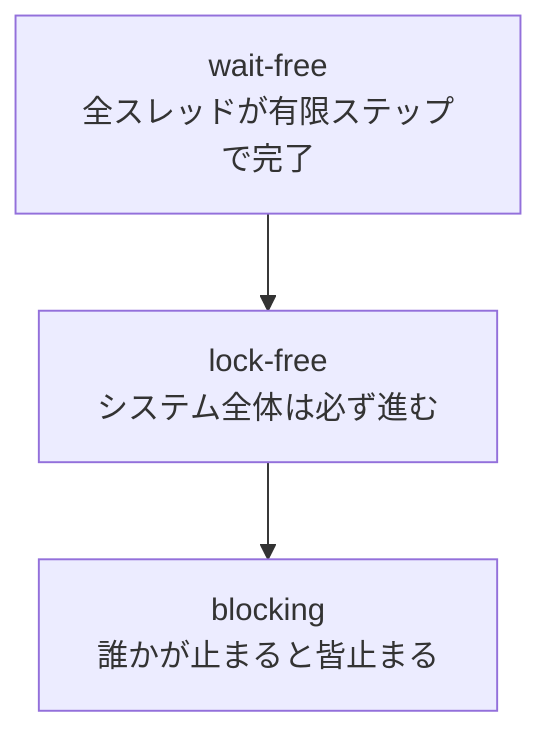
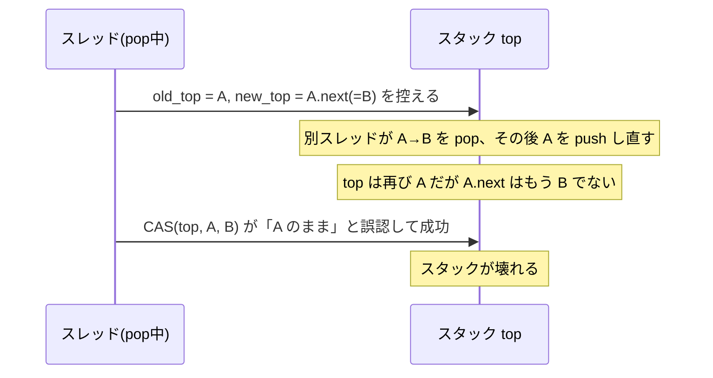

# lock-free の世界

ロックは正しさを保つ強力な道具ですが、本質的な弱点を持ちます。ロックを保持したスレッドが（ページフォルトやスケジューラの都合で）止まると、そのロックを待つ全員も止まる——進行が一人の都合に人質に取られるのです。**ロックフリー（lock-free）** プログラミングは、ロックを使わず atomic 操作だけで並行データ構造を作り、この弱点を克服しようとします。本章は第II部の発展的な内容で、ロックフリーの世界の地図と、その代表的な落とし穴を扱います。

## 進行保証の階層

「ロックを使わない」ことの意味を正確にするため、**進行保証（progress guarantee）** の階層を定義します。これは Herlihy が並行オブジェクトの理論で整理した枠組み[Herlihy のwait-free論文](#cite:herlihy1991)に基づきます。

- **blocking（ブロッキング）**：あるスレッドの遅延が、他スレッドの進行を無期限に妨げ得る。ロックを使う実装はこれ。
- **lock-free（ロックフリー）**：システム全体としては、有限ステップで必ずどれかのスレッドが進む。個々のスレッドは（CAS 失敗を繰り返して）飢えることはあるが、全体は止まらない。
- **wait-free（ウェイトフリー）**：すべてのスレッドが、他スレッドの速度に関係なく、有限ステップで自分の操作を完了する。最も強い保証。



wait-free が理想ですが、一般に実装は複雑で重くなります。実用上の多くの並行データ構造は lock-free を狙います。Herlihy はまた、どんな同期プリミティブがあれば任意の wait-free オブジェクトを作れるかを **コンセンサス数（consensus number）** という尺度で分類し、CAS がコンセンサス数 ∞（最強）であることを示しました。第7章で CAS を礎と呼んだのには、こうした理論的な裏付けがあります。

## ロックフリースタックと ABA 問題

最も基本的なロックフリーデータ構造が、Treiber のスタック[Treiber の報告](#cite:treiber1986)です。先頭ポインタ `top` を CAS で付け替えるだけの単純な構造です。

```ruby
# push: 新ノードの next を現在の top にして、top を新ノードへ CAS で付け替える
def push(node)
  loop do
    old_top = @top.value
    node.next = old_top
    break if @top.compare_and_set(old_top, node)
  end
end

# pop: top を、その次のノードへ CAS で付け替える
def pop
  loop do
    old_top = @top.value
    return nil if old_top.nil?
    new_top = old_top.next
    return old_top if @top.compare_and_set(old_top, new_top)
  end
end
```

一見正しそうですが、ここに有名な落とし穴 **ABA 問題** が潜みます。`pop` が `old_top`（ノード A）を読み、その `next`（ノード B）を控えた直後にプリエンプトされたとします。その間に別スレッドが A を pop し、B も pop し、再び A を push し直したとします。すると `top` は再び A を指しますが、いまや A の next は B ではありません。眠っていたスレッドが目を覚まして CAS すると、「`top` はまだ A だ」と成功してしまい、`top` を（もう存在しないかもしれない）古い B に付け替えてしまいます。



値は A→…→A と戻ったのに「変わっていない」と CAS が誤認するのが ABA です。古典的な対策は、ポインタに **世代カウンタ（tag）** を付け、`(ポインタ, カウンタ)` の組を CAS することです。値が一巡してもカウンタが進むので誤認を防げます。

## メモリ再利用という難問

ABA とも絡む、ロックフリーで最も厄介な問題が **安全なメモリ再利用（safe memory reclamation）** です。`pop` でノードをスタックから外しても、まさにその瞬間に別スレッドがそのノードを読んでいるかもしれません。ロックがあれば「全員が手を離してから解放」できますが、ロックフリーでは「いつ誰も触っていないか」を知るのが難しいのです。早すぎる解放は use-after-free（解放済みメモリへのアクセス）を招きます。

GC のある言語（Ruby、Java など）では、この問題の多くを GC が肩代わりします。「外したノードは、もう誰も参照しなくなったら GC が回収する」ので、実装者は解放のタイミングに悩まなくて済みます。**GC はロックフリープログラミングの隠れた味方** なのです。逆に C/C++ のような手動管理の言語では、専用の再利用手法が必要になります。

### ハザードポインタ

代表的な手法が **ハザードポインタ（hazard pointer）** です。Michael が提案しました[ハザードポインタの論文](#cite:michael2004)。各スレッドは「いま自分が触っているノード」を、グローバルに見える専用スロット（ハザードポインタ）に公示します。ノードを解放したいスレッドは、解放前に全スレッドのハザードポインタを走査し、誰かが公示していたら解放を保留します。「誰も使っていないことを確認してから解放する」を、ロックなしに実現する仕組みです。

### RCU（Read-Copy-Update）

もうひとつの重要な手法が **RCU（Read-Copy-Update）** で、McKenney らが提案し[RCU の論文](#cite:mckenney1998) Linux カーネルで多用されています。RCU は「読み手はほぼ無コスト（バリアすら不要なことも）、書き手は新しいコピーを作って差し替え、古いコピーは『すべての読み手が抜けた』と確実に言える猶予期間（grace period）の後に解放する」という分業です。読み込みが圧倒的に多く書き込みが稀なデータ構造（処理系で言えばクラス階層や設定表など、第13章）に絶大な効果を発揮します。

> [!NOTE]
> ハザードポインタも RCU も、本質は「いつ解放してよいか」をロックなしに判断する仕組みです。GC のある言語処理系を作っているなら、内部のロックフリー構造でも GC に再利用を任せられることが多く、これらを自前で実装する必要は減ります。ただし GC 自体をロックフリー化する場合（第14章）には、これらの考え方が再び必要になります。

## いつロックフリーを使うべきか

ロックフリーは魅力的ですが、安易に手を出すべきものではありません。

- **正しさの検証が極めて難しい**：第4章のメモリモデルを完全に理解し、すべての atomic にメモリ順序を正しく付け、ABA と再利用を漏れなく処理する必要があります。微妙な誤りは、特定のハードウェア・特定のタイミングでしか再現しません。
- **必ずしも速くない**：競合が低ければ、適応的 mutex（第7章）の方が速いことも多い。CAS のリトライが多発すると、ロックより遅くなることもあります。

> [!CAUTION]
> 「ロックフリー＝速い」は誤解です。ロックフリーが提供するのは第一義的に **進行保証**（誰かが止まっても全体は進む）であって、速度ではありません。リアルタイム性が要る・ロック保持者の停止が致命的、といった明確な理由がある箇所に限定して使い、それ以外はまず正しく書ける mutex を選ぶのが賢明です。

## 処理系実装者への含意

言語処理系の内部では、ロックフリー構造が効く箇所が確かにあります。Michael と Scott のロックフリーキュー[Michael-Scott キュー](#cite:michael1996)は、スレッド間のワークキュー（第11章の work-stealing デック）の基礎ですし、メソッドキャッシュ（第15章）やフリーリスト（第14章）の一部にも応用されます。

ただし鉄則は「まず正しく、必要なら速く」です。処理系の共有状態（第13章）をいきなりロックフリー化するのではなく、まず粗いロックで正しく動かし、プロファイル（第20章）でボトルネックを特定してから、その箇所だけをロックフリーや RCU へ置き換える——という順序を強く勧めます。

次章では、共有メモリの難しさから一歩離れ、「そもそも共有しない」メッセージパッシングの実装——チャネル、`select`、アクター、future/promise——へ進みます。
