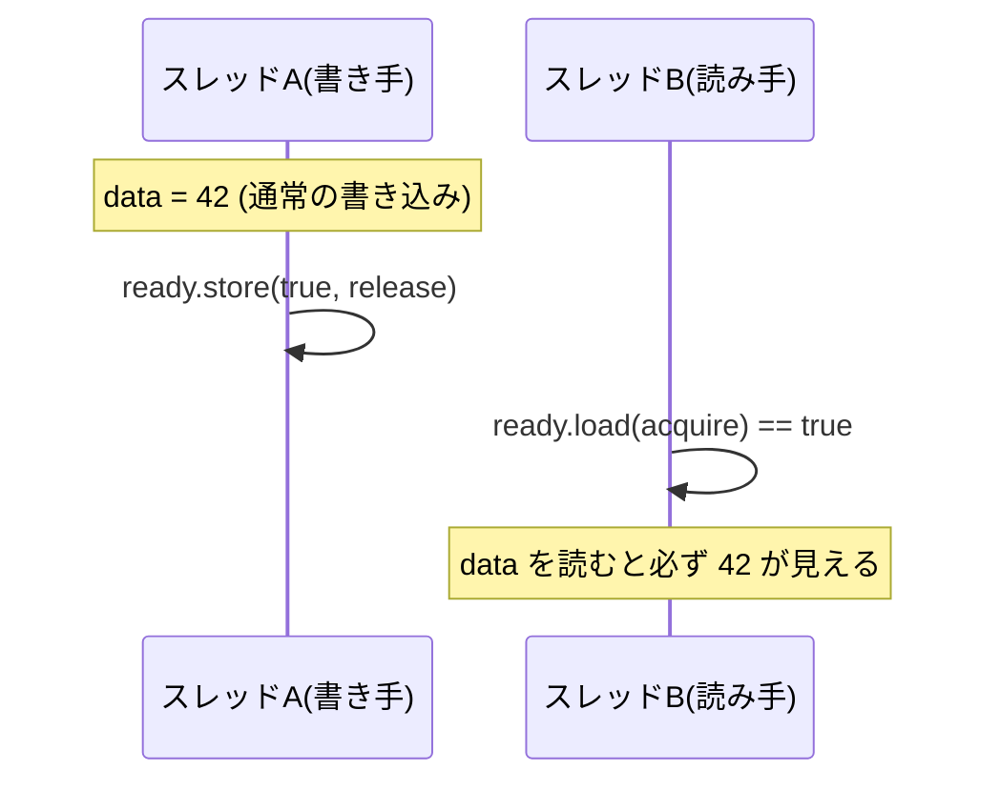

# メモリモデル入門：なぜ素朴な共有は壊れるのか

本章は本書で最も重要な章のひとつです。「複数のスレッドが同期なしに同じ変数を読み書きすると、なぜ・どのように壊れるのか」を理解することが、第II部・第III部のすべての設計判断の前提になるからです。結論を先に言えば、**ハードウェアもコンパイラも、あなたの書いた順序どおりにメモリを触ってはくれない** からです。

## 直感が裏切られる例

次の擬似コードを考えます。2 つのスレッドが、初期値 0 の共有変数 `x` と `y` を使います。

```ruby
# 初期状態: x = 0, y = 0
# スレッド A         # スレッド B
x = 1               y = 1
r1 = y              r2 = x
```

直感的には、「`r1 == 0` かつ `r2 == 0`」は起こり得ないように思えます。A が `r1 = y` を読むとき `y` がまだ 0 なら、A はまだ `y=1` の前にいるので、B はまだ `r2 = x` に来ていないはず……という推論です。しかし実際のハードウェアでは、**両方とも 0 になる** ことが起こり得ます。

理由は、CPU が「自分のスレッドから見て辻褄が合う限り」命令の実行やメモリへの反映を並べ替えてよいからです。A の `x = 1` はストアバッファに溜まり、他コアからはまだ見えないうちに、A は先に `r1 = y` を実行できます。B 側でも同様のことが起きます。結果として両方が相手の書き込みを見ないまま読み取り、ともに 0 になります。

> [!WARNING]
> 「自分のスレッドの中では辻褄が合う」ことと「他のスレッドから見ても辻褄が合う」ことは、まったく別物です。逐次プログラムの直感——書いた順に実行される——は、複数スレッドが同じメモリを見た瞬間に崩壊します。

## 逐次一貫性：理想だが、現実ではない

私たちが暗黙に期待している「直感どおりの世界」には名前があります。**逐次一貫性（sequential consistency, SC）** です。Leslie Lamport が 1979 年に定式化しました[](#cite:lamport1979)。逐次一貫性とは、

1. 各スレッドの操作は、そのプログラムに書かれた順序どおりに実行され、かつ
2. 全スレッドの操作全体が、何らかの 1 本の順序（グローバルな順序）に並べられる、

という性質です。要するに「複数スレッドの操作をトランプのように 1 列に混ぜ合わせた、どれか 1 つの順序で実行したのと同じ結果になる」世界です。先ほどの例で「両方 0」が起きないのは、この逐次一貫性が成り立つ世界の話です。

問題は、**実際のハードウェアは性能のために逐次一貫性を保証しない** ことです。各コアはストアバッファを持ち、書き込みを遅延させ、読み込みを先行させ、独立した命令を並べ替えます。逐次一貫性を常に保証しようとすると、これらの最適化がほぼ全部禁じられ、性能が大きく落ちます。そこでハードウェアは、より弱い保証——**緩和メモリモデル（relaxed/weak memory model）**——だけを提供し、必要な箇所だけ強い順序をプログラマが要求する、という分業にしています。

## リオーダリングの 2 つの出どころ

順序の入れ替え（リオーダリング）は、2 か所で起こります。

1. **コンパイラによる並べ替え**：最適化コンパイラは、依存関係がないと判断した命令を入れ替えたり、変数をレジスタに載せたまま（メモリに書き戻さずに）使い回したりします。
2. **ハードウェアによる並べ替え**：CPU が実行時に、ストアバッファや out-of-order 実行によってメモリ操作の見える順序を変えます。

重要なのは、**両方を同時に抑えないと意味がない** ことです。コンパイラだけ抑えても CPU が並べ替えますし、逆もまた然りです。この「両方を抑える必要がある」という事実こそ、Hans Boehm が「スレッドはライブラリとしては実装できない」[](#cite:boehm2005)と論じた核心です。コンパイラが並行性を知らないまま最適化すると、ライブラリ側でいくらロックを書いても正しさを保証できない——だから並行性のセマンティクスは **言語仕様の一部** でなければならない、という主張です。これは言語処理系の作り手に直接突きつけられた要求です。

## acquire/release とメモリバリア

では、必要な箇所でどう順序を取り戻すのか。鍵は **メモリバリア（memory barrier / fence）** と、それを抽象化した **acquire/release セマンティクス** です。

- **release（解放）操作**：これより前のメモリ操作が、この操作より後ろに（他スレッドから見て）追い越されないことを保証します。データを準備し終えてからフラグを立てる「書き手」側で使います。
- **acquire（獲得）操作**：これより後のメモリ操作が、この操作より前に追い越されないことを保証します。フラグを確認してからデータを読む「読み手」側で使います。

この 2 つを組にすると、「書き手の release より前の書き込みは、その値を acquire で読んだ読み手から、すべて見える」という保証が得られます。これが **happens-before（先行発生）** 関係です。スレッドをまたいで「この出来事は、あの出来事より確実に前」と言える唯一の手段が、こうした同期操作で張った happens-before の鎖です。



逆に言えば、**同期操作で happens-before の鎖を張らずに、複数スレッドが同じ変数を触り、少なくとも一方が書き込みなら、それはデータ競合** です。そして多くの言語のメモリモデルでは、データ競合を含むプログラムの動作は **未定義（undefined）** とされます。「未定義」とは「0 か 1 のどちらかになる」ではなく、「何が起きてもおかしくない（クラッシュも含む）」という意味です。

> [!CAUTION]
> 「たまに変な値が読めるだけだろう」と侮ってはいけません。データ競合のあるコードは、コンパイラが「競合は起きない前提」で最適化するため、変数が消えたり、ループが無限化したり、まったく無関係に見えるコードが壊れたりします。データ競合は「弱い保証」ではなく「保証なし」です。

用語をひとつ区別しておきます。ここで定義した**データ競合（data race）**は、メモリモデル上の概念です。一方、もっと広く「実行のタイミングや順序で結果が変わってしまう」論理的な問題を**競合状態（race condition）**と呼びます。atomic やロックで個々のアクセスのデータ競合を消しても、「残席を確認してから予約する」のような複数操作のまとまりをひとつの不可分な操作にしなければ、論理的な競合状態は残ります（第5章の「複数バイトコードからなる論理操作」の話がまさにこれです）。データ競合ゼロは出発点であって、ゴールではありません。

## 言語メモリモデルという発明

ハードウェアごとにメモリモデルが違うと、処理系の実装者は移植のたびに混乱します。そこで現代の言語は、**ハードウェアから独立した自前のメモリモデル** を仕様として定めます。処理系は、各ハードウェアでそのモデルを実現するために必要なバリアを挿入する責務を負います。

その先駆けが **Java メモリモデル（JMM）** で、Manson・Pugh・Adve による 2005 年の定式化[](#cite:manson2005)が決定版になりました。JMM は「データ競合のないプログラムは逐次一貫性を持つ（DRF-SC: data-race-free implies sequential consistency）」という保証を中心に据えます。つまり「きちんと同期すれば直感どおりに動く。同期しなければ何が起きても文句は言えない」という契約を、言語として明文化したのです。C++11 以降の C++ メモリモデルもこの考え方を継承し、`memory_order_seq_cst` / `acquire` / `release` / `relaxed` といった段階を提供します。最弱の `relaxed` は、操作の不可分性だけを保証し、他のメモリ操作との順序はほぼ保証しません。ロックの実装や「準備してから公開する」用途には不十分ですが、統計カウンタや ID 生成のように「値が壊れなければ順序はどうでもよい」場面では、最小コストの道具として有用です。メモリモデルの体系的な入門としては、Adve と Gharachorloo のチュートリアル[](#cite:adve1996)が今も標準的な参照先です。

## 処理系実装者への含意

本章の結論を、実装者の立場でまとめます。

- **自分の言語のメモリモデルを定義する責任がある**。「とりあえずスレッドを足す」だけでは、ユーザはどう書けば安全かを知る術がありません。
- **DRF-SC を契約の中心に据える** のが現代的な定石です。普通のユーザには「適切に同期すれば逐次一貫性、しなければ未定義」を約束し、低レベルの atomic は上級者向けに分けて提供します。
- **コンパイラとランタイムの両方でバリアを正しく挿入する**。最適化が同期を追い越さないよう、処理系のコード生成と JIT の両方が並行性を意識しなければなりません。

> [!NOTE]
> 本章はやや抽象的でした。次章では、実際に動かせる極小インタプリタを題材に、ここで述べたデータ競合を「自分の手で踏んで」みます。抽象的な「未定義動作」が、具体的な「カウンタの値が合わない」「処理系がクラッシュする」として立ち現れる様子を体験するのが目的です。
