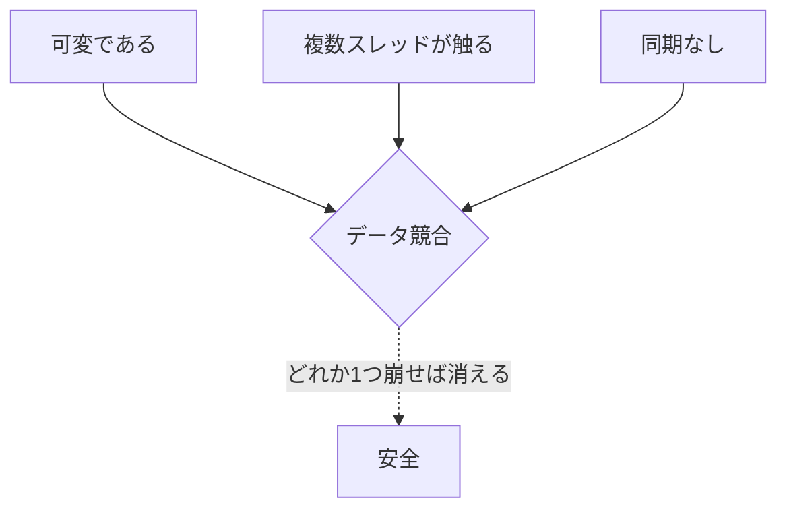
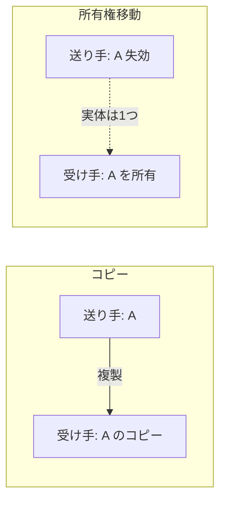

# オブジェクト共有モデル：隔離・所有権・型で守る

第III部を通じて繰り返し現れた教訓は、「最良の同期は、同期しなくて済むように設計を変えること」でした。本章はその発想を設計原理にまで高めます。すなわち、**そもそもオブジェクトを共有させない**、あるいは**共有してよいオブジェクトを限定し、それを型で強制する** ——という、並列処理系の最も根本的な設計判断です。GVL を外す（第16章）難しさの大半が「無秩序な共有」に由来する以上、共有そのものを設計で律することは、問題を末端で潰すのではなく根で断つアプローチです。

## 共有の何が問題だったのか

第5章から第16章まで、データ競合のあらゆる事例は、煎じ詰めれば一点に帰着します。**可変（mutable）なオブジェクトを、複数スレッドが同時に、同期なしに触る** こと——この 3 要素が揃ったときだけ競合は起きます。逆に言えば、3 要素のどれか 1 つでも崩せば競合は構造的に消えます。



本章で扱う各アプローチは、この 3 要素のどれを崩すかで整理できます。**不変にする**（可変を崩す）、**隔離・所有権**（複数アクセスを崩す）、**型で同期を強制**（同期なしを崩す）。順に見ていきます。

## 不変性：可変であることをやめる

最も単純な解は、オブジェクトを **不変（immutable）** にすることです。一度作ったら誰も書き換えないなら、何スレッドが同時に読んでも競合しません。読み取りだけなら同期は不要だからです。関数型言語が並列化と相性がよいのは、データが基本的に不変だからにほかなりません。

Ruby でも、凍結（`freeze`）した文字列やオブジェクトは安全に共有できます。第16章で触れた Ractor[Ractor のドキュメント](#cite:ractor2020) は、深く凍結された不変オブジェクト（および特別な共有可能オブジェクト）だけを、複数の Ractor 間で参照共有してよい、と定めています。

```ruby
CONFIG = { timeout: 30, retries: 3 }.freeze   # 凍結＝不変
# 不変なので、何スレッド（何 Ractor）から読んでも安全
```

不変性の代償は、更新がコピーになることです。「1 要素だけ変えたい」ときも新しいオブジェクトを作るので、素朴にやるとコストがかさみます。これを永続データ構造（persistent data structure、変更時に共有部分を再利用する）で緩和するのが、関数型言語の定石です。

## 隔離とコピー：複数アクセスをやめる

不変にできない（更新が本質的に必要な）オブジェクトには、**隔離（isolation）** を使います。各実行主体に状態を閉じ込め、他からは直接触れさせない。第9章のアクター、第16章の Ractor がこれです。隔離されたオブジェクトは、たとえ可変でも、常に 1 つの主体しか触らないので競合しません。

隔離モデルでは、データを渡すときに 2 つの選択肢があります。

- **コピー（copy）**：送るときに値を複製する。送り手と受け手が別々の実体を持つので、以後どちらが変更しても干渉しない。安全だが、大きなデータでは複製コストが高い。
- **所有権の移動（move / ownership transfer）**：実体は 1 つのまま、「触ってよい主体」を送り手から受け手へ移す。送り手は渡した後そのオブジェクトに触れなくなる。コピー不要で速いが、「移動後に送り手が触らない」ことを保証する仕組みが要る。



Ractor のメッセージ送信は、まさにこの 2 つを区別します。`send` でコピーを渡すか、`Ractor.make_shareable` や move 送信で所有権を移すか。所有権を移したオブジェクトに送り手が触ろうとするとエラーになります——「移動後は触れない」を実行時に強制するのです。

> [!NOTE]
> 隔離は、第16章の GVL の議論と直結します。Ractor が「Ractor ごとに GVL を持つ」設計で並列実行できるのは、各 Ractor が状態を隔離しているからです。共有しないからロックが要らず、ロックが要らないから並列に走れる。第III部の共有状態問題を、解くのではなく **発生させない** ことで回避しているのです。

## 所有権を型で守る：Rust の借用

隔離やコピーは安全ですが、「本当はこのデータを複数箇所から効率よく触りたい」場合には窮屈です。Rust は別の道を選びました。共有を許しつつ、**コンパイル時の型システムで競合を不可能にする** のです。

Rust の所有権システムの核は、次の規則です。

- 各値には唯一の所有者がいる。所有者がスコープを抜けると値は破棄される。
- 値への参照（借用、borrow）には 2 種類ある：**不変借用（`&T`、共有参照）** は同時に何個でも持てるが書き換えられない。**可変借用（`&mut T`、排他参照）** は同時に 1 つしか持てないが書き換えられる。
- 「複数の共有参照」と「1 つの排他参照」は同時に存在できない。

```rust
// Rust: コンパイラが競合を弾く
let mut data = vec![1, 2, 3];
let r1 = &data;        // 不変借用（読み取り）
let r2 = &data;        // 不変借用は同時に複数 OK
// let w = &mut data;  // ← これはコンパイルエラー：
//                        共有借用がある間は可変借用できない
```

この規則は、まさに第8章で触れた read-write の非対称性（読みは共有、書きは排他）を、**実行時のロックではなくコンパイル時の型検査で** 強制したものです。「複数の読み手 XOR 1 つの書き手」が型レベルで保証されるので、データ競合は **コンパイルが通った時点で原理的に存在しません**。Rust はこれを "fearless concurrency（恐れない並行性）" と呼びます。この所有権システムが本当に健全（安全）であることは、RustBelt[RustBelt の論文](#cite:jung2018) によって形式的に証明されています。

> [!IMPORTANT]
> Rust のアプローチの本質は、「並行バグを実行時に検出する」のではなく「並行バグを書けなくする」ことです。第18章で扱うデータ競合検出ツールは「走らせてみて競合を見つける」事後的な手段ですが、型システムは「そもそも競合するコードはコンパイルできない」事前的な手段です。事前に防げるなら、それに越したことはありません。代償は、所有権と借用という新しい規律をプログラマが学ぶ必要があることです。

## 型で通信プロトコルを守る：セッション型

所有権が「データを誰が触れるか」を型で守るなら、**セッション型（session types）** は「通信の順序」を型で守ります。Honda らが提案しました[セッション型の論文](#cite:honda1998)。

第9章のチャネル通信には、データ競合とは別種のバグがありました。送受信の食い違い（送るべきときに受けようとする）、プロトコル違反（ログインの前にデータを要求する）、デッドロックなどです。セッション型は、チャネルに「このチャネルでは、まず int を送り、次に string を受け取り、then 終了」といった **通信の筋書き（プロトコル）を型として付与** し、その筋書きから外れた通信をコンパイル時に弾きます。

```
# セッション型のイメージ（疑似記法）
# サーバ側のプロトコル型: ?Int . !String . end
#   = まず Int を受け取り、次に String を送り、終了する
# クライアント側は、その双対（dual）: !Int . ?String . end
#   = まず Int を送り、次に String を受け取る
# 両者が双対でなければコンパイルエラー
```

セッション型は、共有メモリの競合ではなく、**メッセージパッシングの正しさ** を型で保証する道具です。第9章で「メッセージパッシングはバグの種類を移し替える（止まるバグになる）」と述べましたが、セッション型はその移し替えた先のバグすら、型で防ごうとする試みです。

## 設計判断の地図

本章で見たアプローチを、「何を犠牲にして何を得るか」で並べます。

| アプローチ | 競合を防ぐ仕組み | 主な代償 | 代表例 |
|-----------|-----------------|----------|--------|
| 不変性 | 可変をやめる | 更新がコピーになる | 関数型言語、`freeze` |
| 隔離＋コピー | 複数アクセスをやめる | 複製コスト | アクター、Ractor |
| 所有権移動 | 触れる主体を 1 つに | 移動後アクセス不可 | Ractor の move、Rust |
| 所有権の型検査 | 型で読み書きを排他 | 学習コスト・表現の制約 | Rust の借用 |
| セッション型 | 型で通信順序を強制 | 型システムの複雑さ | セッション型処理系 |

> [!TIP]
> これらは排他的な選択ではなく、層をなして組み合わせられます。「内部は共有メモリ＋ロック、ユーザには隔離されたアクターを見せ、その間の通信を型で守る」といった積層が現実的です。重要なのは、**どこまでを実行時の同期（ロック・atomic）で守り、どこからを設計と型で防ぐか** を意識的に決めることです。実行時の同期は柔軟だが間違えやすく、設計・型による防御は厳格だが窮屈——このトレードオフが、並列言語の「設計思想」そのものを決めます。

これで第III部は終わりです。処理系内部の共有状態を棚卸しし（第12章）、GC・キャッシュ・参照カウントを点検し（第13〜15章）、GVL という逃げとその代償を理解し（第16章）、最後に共有そのものを設計で律する道（本章）を見ました。第IV部では、こうして作った並列処理系を **どう検証し、どう評価するか**、そして実在の処理系がこれらの選択をどう具現化しているかを扱います。
