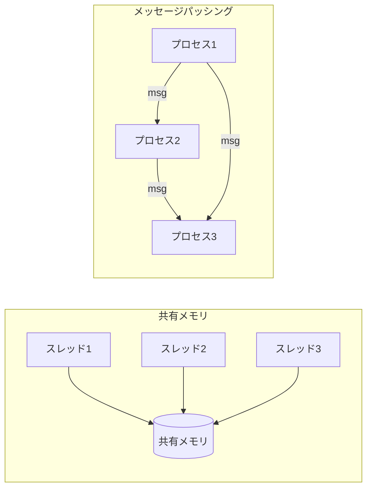
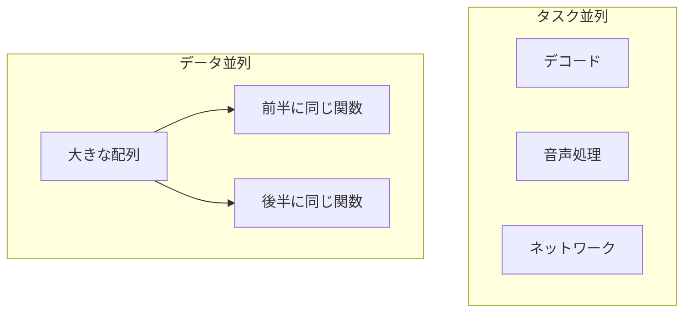

# 並行・並列モデルの地図

並列実行を言語に載せるとき、最初に決めなければならないのは「ユーザに、どういう世界観で並行性を書かせるか」です。これを **並行モデル（concurrency model）** と呼びます。モデルの選択は、API の見た目だけでなく、処理系内部の作り、性能特性、そしてどんなバグが起きやすいかまでを決定づけます。本章では主要なモデルの地図を描きます。

## 2 つの大きな分かれ道：共有メモリとメッセージパッシング

並行モデルの最も根本的な分岐は、**複数の実行主体がどうやって情報をやり取りするか** です。

**共有メモリ（shared memory）** モデルでは、複数のスレッドが同じメモリ空間を共有し、同じ変数やオブジェクトを直接読み書きすることで通信します。直感的で、既存の逐次プログラムから移行しやすい一方、「誰がいつどこを触るか」を人間が正しく管理しなければデータ競合に陥ります。C/C++、Java、Ruby のスレッドなどが代表例です。

**メッセージパッシング（message passing）** モデルでは、実行主体は互いのメモリを直接触らず、**メッセージを送り合う** ことで通信します。状態は各主体に閉じ込められ、共有されません。「共有しないものは壊れない」という発想で、データ競合を構造的に避けられます。Erlang、Go（チャネル）、Ractor などが代表例です。

どちらが優れているという話ではありません。共有メモリは細粒度のデータ共有で性能を出しやすく、メッセージパッシングは正しさを保ちやすく分散にも素直に拡張できます。多くの実用言語は両方を、層を分けて提供します。

## CSP：チャネルを第一級に

**CSP（Communicating Sequential Processes、通信逐次プロセス）** は、Tony Hoare が 1978 年に提案した理論[CSP の原論文](#cite:hoare1978)で、メッセージパッシングモデルの古典です。CSP では、独立した逐次プロセスたちが **チャネル（channel）** を通じて通信します。プロセスは互いの名前を知る必要はなく、チャネルという「管」を介してデータをやり取りします。

CSP の特徴は、送受信が **同期的（rendezvous、ランデブー）** であり得る点です。送り手は受け手が受け取るまで待ち、受け手は送り手が送るまで待ちます。この「出会い」が同期点になります。Go の `goroutine` と `channel` は CSP の直系の子孫で、`select` 文で複数チャネルを待つ機構（第9章）も CSP 由来です。

## アクターモデル：状態を持つ独立した主体

**アクターモデル（actor model）** は、Carl Hewitt らが 1973 年に提案しました[アクターモデルの原論文](#cite:hewitt1973)。アクターは、自分専用の状態を持ち、メッセージを受け取って動く独立した主体です。アクターはメッセージを受け取ると、(1) 他のアクターへメッセージを送る、(2) 新しいアクターを生成する、(3) 次に受け取るメッセージへの振る舞いを変える、という 3 種類のことができます。

CSP との違いは、CSP がチャネル（通信路）を第一級にするのに対し、アクターは **アクター（受け手）を第一級にし、各アクターが受信箱（mailbox）を持つ** 点です。送信は基本的に非同期で、相手の受信箱に入れたら送り手は先へ進みます。Erlang/Elixir のプロセス[Armstrong の学位論文](#cite:armstrong2003)、Akka、そして Ruby の Ractor[Ractor のドキュメント](#cite:ractor2020)がこの系譜です。

> [!NOTE]
> CSP とアクターはどちらも「状態を共有せずメッセージで通信する」点で同じ家族ですが、強調点が違います。「通信路（チャネル）を中心に考える」のが CSP、「状態を持つ主体（アクター）を中心に考える」のがアクターです。実装上は、チャネルを 1 対 1 で固定すればアクターの mailbox に近づくなど、互いに表現し合えます。

## タスク並列とデータ並列

通信の軸とは別に、「何を並列の単位にするか」という軸があります。

**タスク並列（task parallelism）** は、互いに異なる仕事（タスク）を並列に走らせます。「画像をデコードしながら別のタスクで音声を処理する」のように、異種の処理を同時に進めるイメージです。アクターやスレッドプール、後述する work-stealing スケジューラ（第11章）と相性がよい考え方です。

**データ並列（data parallelism）** は、同じ処理を大量のデータに対して並列に適用します。「100 万要素の配列の各要素に同じ関数を適用する」のように、同種の処理をデータで分割します。並列ループや map/reduce（第12章）、SIMD、GPU がこの系統です。

実際のアプリケーションは両者を組み合わせます。「複数のリクエストを並列に処理し（タスク並列）、各リクエスト内で大きな配列を並列に変換する（データ並列）」といった具合です。

## モデルが処理系に課す要求

処理系の実装者にとって、どのモデルを採るかは内部の作りを大きく左右します。

| モデル | 主に必要になる仕組み | 主な落とし穴 |
|--------|---------------------|-------------|
| 共有メモリ | スレッド、ロック、atomic、メモリモデルの規定 | データ競合、デッドロック |
| CSP | チャネル、`select`、軽量スレッド | チャネルの過不足によるブロック |
| アクター | mailbox、メッセージのコピー／所有権移動、スケジューラ | mailbox 肥大、メッセージのシリアライズ |
| データ並列 | 並列ループ、ワークスケジューラ、SIMD/GPU 連携 | 負荷の偏り、粒度の取り方 |

> [!TIP]
> 多くの成功した言語は「下層に共有メモリ＋スレッド、上層にメッセージパッシングや構造化並行性」という積層構造を持ちます。本書もこの順序で進みます。第II部の前半（第6〜8章）は共有メモリの世界を、後半（第9〜12章）はメッセージパッシングとデータ並列を扱います。

次章では、これらすべてのモデルの正しさの土台となる **メモリモデル** に踏み込みます。「素朴に共有すると、なぜ・どのように壊れるのか」を理解しないまま共有メモリモデルを実装すると、再現しないバグの沼に沈むことになるからです。
