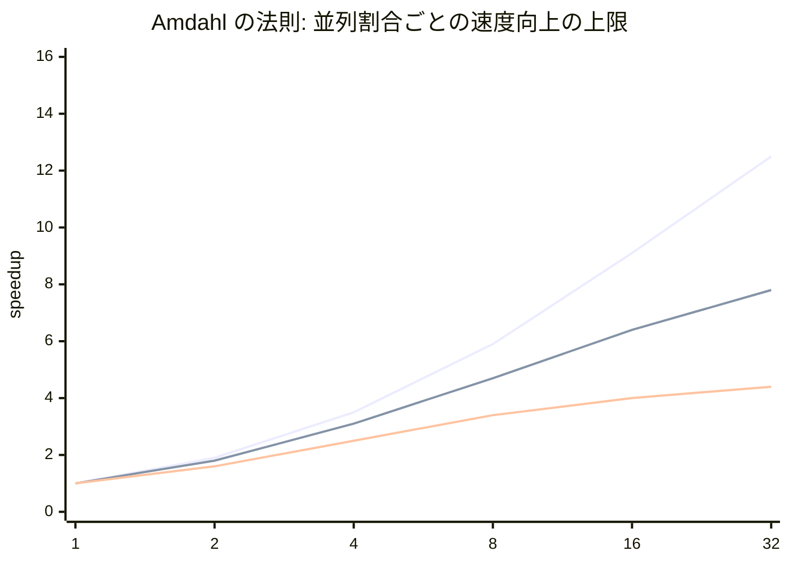
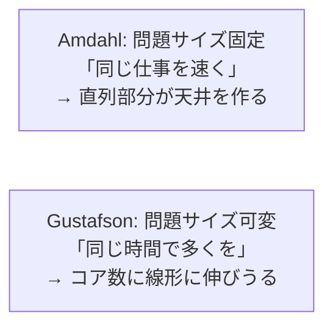
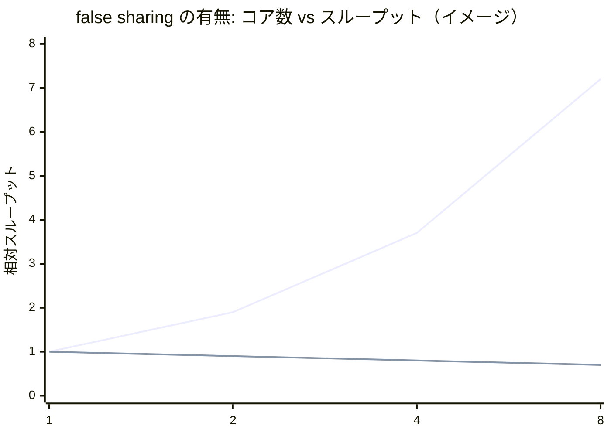

# 性能評価：速くならない理由を測る

並列処理系を正しく作っても、それが速いとは限りません。「8 コアにしたのに 2 倍にもならない」は、並列化に取り組んだ誰もが通る道です。本章では、並列性能を理解し測定するための基礎——Amdahl の法則と Gustafson の法則、スケーラビリティの測り方、そして第14章で予告した false sharing の実測——を扱います。性能評価は感覚ではなく、測定と理論に基づくべき営みです。

## Amdahl の法則：直列部分が天井を決める

並列化の効果には、原理的な上限があります。それを定式化したのが **Amdahl の法則**[](#cite:amdahl1967) です。プログラムのうち並列化できる割合を `p`（残り `1-p` は本質的に直列）、コア数を `N` とすると、得られる速度向上（speedup）の上限は次式になります。

```math
S(N) = \frac{1}{(1-p) + \frac{p}{N}}
```

この式が突きつける事実は厳しい。コアを無限に増やしても（`N → ∞`）、速度向上は `1/(1-p)` で頭打ちになります。たとえば 5% が直列（`p = 0.95`）なら、コアをいくら積んでも 20 倍が天井です。直列部分が 5% あるだけで、上限が 20 倍に固定されてしまうのです。



上の図は、並列割合が 95%・90%・75% のときの速度向上です。並列割合が下がるほど早く頭打ちになり、コアを増やす効果が急速に薄れるのが見て取れます。第17章で「GVL は Amdahl の極端形（並列割合が実質ゼロ）」と述べたのは、この曲線が完全に平らになることを指していました。

> [!IMPORTANT]
> Amdahl の法則の実践的な教訓は、「**並列化の前に、直列部分を減らせ**」です。第III部で見た処理系内部のロック——GC の STW、グローバルロック、シンボル表の排他——は、すべてプログラムに直列部分を持ち込みます。`p` を大きくする（直列部分を削る）ことが、コア数を増やすより本質的に効くことが多いのです。

## Gustafson の法則：問題を大きくすれば希望はある

Amdahl の法則は悲観的に見えますが、前提に「問題サイズが固定」という仮定が隠れています。**Gustafson の法則**[](#cite:gustafson1988) は、この前提を問い直しました。

現実には、コアが増えれば、人はより大きな問題を解こうとします。「同じ問題を速く解く」のではなく「同じ時間でより大きな問題を解く」のです。多くの実用的計算では、コア数を増やすと並列化できる部分（データの量に比例する計算）が増え、直列部分（初期化やまとめ）の相対的な割合は減ります。この **スケールする問題** の視点では、速度向上は次のように、コア数に対してほぼ線形に伸び得ます。

```math
S(N) = N - (1-p)(N-1)
```



両者は矛盾しません。**同じ現実を、異なる問いで切り取っている** のです。Amdahl は「固定した仕事を、何倍速くできるか（strong scaling、強スケーリング）」を、Gustafson は「コアを増やしたぶん、どれだけ大きな仕事をこなせるか（weak scaling、弱スケーリング）」を測ります。処理系の性能を語るときは、どちらの問いに答えているのかを明示する必要があります。

## スケーラビリティの測り方

性能評価で最も大切なのは、**正しく測る** ことです。素朴な測定は、いとも簡単に誤った結論を導きます。

- **strong scaling を測る**：問題サイズを固定し、コア数 1, 2, 4, 8, ... に対して実行時間を測り、`speedup = T(1) / T(N)` をプロットする。理想は直線（N 倍）。どこで頭打ちになるかが、直列部分やボトルネックを示す。
- **weak scaling を測る**：コアあたりの問題サイズを固定し、コア数とともに総問題サイズを増やして、実行時間が一定に保たれるかを見る。
- **効率（efficiency）を見る**：`efficiency = speedup / N`。1.0 に近いほど良い。これが落ちていく点に、競合やオーバーヘッドが現れる。

> [!WARNING]
> 並列性能の測定には落とし穴が多くあります。(1) **ウォームアップ不足**：JIT（第15章）や GC（第14章）が温まる前の測定は当てにならない。(2) **測定対象の取り違え**：I/O 待ちが支配的なのに CPU 並列性を測っている。(3) **1 コアの基準が間違い**：並列版を 1 コアで動かした時間ではなく、**最良の逐次版** を基準にしないと、speedup を水増ししてしまう。(4) **ばらつきの無視**：並列実行は実行ごとのばらつきが大きいので、複数回測って分布を見るべき。これらを怠ると、「速くなった」という誤った結論に簡単にたどり着きます。

## false sharing を実測する

第14章で予告した **false sharing（偽共有）** は、性能評価で必ず疑うべき容疑者です。別々のスレッドが更新する別々の変数が同じキャッシュライン（第2章、典型的に 64 バイト）に同居すると、ハードウェアがそのラインを奪い合い、性能が崩壊します。ソースを読んでも「共有していない」ので、測定でしか見つかりません。

典型的な実験を考えます。スレッドごとのカウンタを「詰めて」並べた場合と、キャッシュライン境界に「離して」並べた場合で、同じ並列カウントの速度を比較します。

```ruby
# 詰めて配置（false sharing が起きる）: 隣同士が同じ 64 バイトに乗る
counters = Array.new(n_threads, 0)   # 要素が密に並ぶ

# 離して配置（false sharing を避ける）: 各カウンタを別ラインへ
# 各スレッドはまずローカル変数で数え、最後に一度だけ書き戻す、でも回避できる
def worker(local_count)
  local = 0
  iterations.times { local += 1 }    # 共有に触れない
  local_count.value = local          # 最後に一度だけ
end
```

「詰めた」版は、論理的には各スレッドが別のカウンタを触っているのに、物理的には同じラインを奪い合うため、コアを増やすほど **遅くなる** ことすらあります。一方「離した／ローカルに数えてから書き戻す」版は素直にスケールします。両者を実測すると、しばしば数倍の差が出ます。



上の図のように、false sharing があると（下の線）コアを増やしても伸びず、むしろ落ちます。これを見抜くには、`perf` のようなプロファイラでキャッシュミス（特に HITM: modified line のヒット）を測るのが確実です。「並列化したのに速くならない、むしろ遅い」と感じたら、まず false sharing を疑い、データ配置とパディング（第14章）を見直してください。

> [!NOTE]
> 第12章の並列 reduce で「共有カウンタを叩くより、各ワーカが部分結果を持つ方が速い」と述べたのは、この false sharing（と atomic 競合）を避けるためでした。本章はそれを実測で裏付ける章です。「共有を減らすほど速くなる」という本書の原則は、理論（Amdahl）でも実測（false sharing）でも一貫して現れます。

## 性能評価のまとめ

- Amdahl の法則：直列部分が速度向上の天井を決める。並列化の前に直列部分を削れ。
- Gustafson の法則：問題サイズを増やせる前提なら、コア数に線形に伸びうる。strong/weak scaling を区別せよ。
- 測定は、最良の逐次版を基準に、ウォームアップとばらつきに注意して行う。
- false sharing は測定でしか見つからない性能の罠。データ配置とローカル集約で回避し、プロファイラで実証する。

理論と測定の道具が揃いました。最終章では、本書で積み上げた概念が、現実の処理系——Go、Erlang/BEAM、Java、Ruby、Python——でどう具現化しているかを横断的に振り返ります。
