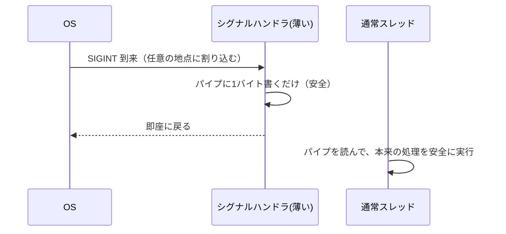

# 参照カウント、I/O・例外・シグナルの排他

本章では、並列化で「正しくはできるが、その代償が重い」処理系内部の代表例を 2 つ扱います。ひとつは **参照カウントの atomic 化**、もうひとつは **I/O・例外・シグナル** という、見落とされがちだが排他が必要な箇所です。とくに参照カウントの話は、なぜ多くの処理系が GIL/GVL（第16章）という「逃げ」を選んだのかを理解する鍵になります。

## 参照カウント方式の GC

GC の方式には、第13章で扱った「到達可能性をたどる」トレース型のほかに、**参照カウント（reference counting）** があります。各オブジェクトが「自分を参照している数」を持ち、参照が増えれば +1、減れば −1、0 になったら即座に解放する方式です。CPython がこの方式を採っており、Swift（ARC）や多くの C++ のスマートポインタもこれです。

```ruby
# 概念図：参照カウント
def incref(obj); obj.refcount += 1; end
def decref(obj)
  obj.refcount -= 1
  free(obj) if obj.refcount == 0   # 0 になったら回収
end
```

参照カウントの利点は、回収が即座で、停止時間が分散し、実装が比較的素直なことです。欠点は、循環参照を回収できないこと、そして——本章の主題である——**並列化のコストが高い** ことです。

## なぜ atomic 化が重いのか

`obj.refcount += 1` は、第5章でさんざん見た read-modify-write です。複数スレッドが同じオブジェクトを同時に参照・解放すると、カウントの increment/decrement が競合し、カウントが狂います。カウントが過小評価されれば、まだ使われているオブジェクトを解放して use-after-free を起こし、過大評価されればメモリリークになります。前者は処理系のクラッシュに直結する最悪のバグです。

正しくするには、increment と decrement を **atomic 操作**（第7章の `fetch_and_add` や CAS）にする必要があります。これ自体は技術的に簡単です。問題はその **頻度** です。

参照カウントは、オブジェクトを触るたびに——変数に代入するたび、関数に渡すたび、コンテナに入れるたび——更新されます。処理系の中で **最も頻繁に実行される操作のひとつ** なのです。その一つひとつを atomic 命令にすると、たとえ競合がなくても、atomic 命令自体のコスト（メモリバリアやキャッシュコヒーレンシのトラフィック、第2章）が全体に重くのしかかります。


> [!IMPORTANT]
> ここが決定的な点です。参照カウントの atomic 化は **「できるかできないか」ではなく「速いか遅いか」の問題** です。正しく動かすのは簡単。しかし、共有されていない（1 スレッドしか触らない）オブジェクトのカウント操作にまで atomic のコストを払うのは、ほとんど無駄です。実際、ほとんどのオブジェクトはスレッドをまたいで共有されません。にもかかわらず、どれが共有されるか事前にわからないため、全部を atomic にせざるを得ない——これが atomic 参照カウントの本質的な非効率です。

## 代償を減らす工夫

この代償を減らす技法がいくつかあります。

- **バイアス付き参照カウント（biased reference counting）**：オブジェクトを最初に作ったスレッド（所有者）からの操作は非 atomic な専用カウンタで、他スレッドからの操作だけ atomic な共有カウンタで数える。ほとんどの操作が所有者からなので、atomic を大幅に減らせる。
- **遅延カウント／合体**：短命な参照（一時変数など）のカウント増減を、まとめて相殺してから反映する。
- **不変オブジェクトの除外**：`nil`・`true`・小さな整数・凍結リテラルなど、解放されない不変オブジェクトはカウントを更新しない。

CPython の no-GIL 化（第16・20章）[PEP 703](#cite:pep703) は、まさにこの「参照カウントを並列化しても遅くしない」ための工夫の集大成です。バイアス付き参照カウント、不変オブジェクトの恒久化（immortalization）、遅延カウントなどを組み合わせて、GIL を外しても単一スレッド性能を落とさないことを目指しています。「参照カウントの atomic 化の代償」がいかに重く、それを軽くするのにどれだけの工夫が要るかを示す、生きた実例です。

## I/O の排他

参照カウントから話を変えて、見落とされがちな共有資源を扱います。まず **I/O** です。

複数スレッドが同じ出力先（たとえば標準出力）に同時に書き込むと、出力が混ざります。「`Hello\n`」と「`World\n`」が `HeWolrllod\n` のように交錯するのです。これはバッファが共有された可変状態だからで、第5章のスタック破壊と同じ構図です。処理系（やランタイムライブラリ）は、I/O ストリームへの書き込みをロックで保護し、少なくとも 1 回の書き込みが分割されないようにする責務を負います。

さらに厄介なのが、ファイルディスクリプタの **位置（オフセット）** の共有です。同じファイルを複数スレッドが読み書きすると、「read で進んだ位置」が共有され、互いの読み書き位置を踏み合います。対策として、位置を持たない `pread`/`pwrite`（読み書き位置を引数で渡す）を使う、ファイルハンドルをスレッドごとに分ける、といった設計が必要です。

> [!NOTE]
> I/O の排他は、第10章の軽量スレッドとも絡みます。M:N ランタイムでは、ブロックする I/O を非ブロッキング I/O ＋イベント通知に変換しますが、その変換層自体が共有資源（イベントループの登録表）への並行アクセスを正しく扱わねばなりません。「ユーザには同期的に見える I/O」を裏で安全に並行化するのは、ランタイムの隠れた大仕事です。

## 例外とシグナルの排他

最後に、制御の流れに関わる 2 つの厄介者を扱います。

**例外** の処理は、巻き戻し（unwinding）の途中状態という、危うい一時状態を持ちます。第6章で触れたとおり、例外がスレッドの境界を越えるときの扱い（子スレッドの例外を join 側へ渡す）は設計判断が要ります。スレッドごとに「現在処理中の例外」の状態を持たせる（TLS、第6章）のが基本で、これを共有すると巻き戻しが交錯して壊れます。

**シグナル（signal）** はさらに難物です。シグナルは UNIX で非同期にプロセスへ届く通知（`SIGINT` での中断など）で、2 つの意味で並行性と衝突します。

1. **どのスレッドが受けるか**：マルチスレッドプロセスでは、シグナルがどのスレッドに配送されるかは制御が難しい。処理系はたいてい「1 本の専用スレッドだけがシグナルを受ける」よう構成し、他スレッドではマスクします。
2. **シグナルハンドラの中でできることが極端に限られる**：シグナルハンドラは、実行中の任意の地点に割り込みます。その地点でロックを保持していたら、ハンドラ内で同じロックを取ろうとしてデッドロックします。だからハンドラ内では **async-signal-safe** な操作（限られたシステムコールなど）しか使えません。

定石は **self-pipe トリック**——ハンドラ内では「パイプに 1 バイト書く」という安全な操作だけ行い、実際の処理は通常のスレッドがそのパイプを読んで行う、という方式です。ハンドラを極限まで薄くし、危険な処理を通常の実行文脈に逃がすのです。



> [!CAUTION]
> シグナルハンドラ内でロックを取る・メモリを確保する・大半のライブラリ関数を呼ぶ、はすべて未定義動作の地雷です。並列処理系でシグナルを扱うときは、「ハンドラは旗を立てるだけ、仕事は通常スレッドが拾う」を徹底してください。ここを横着すると、極めて稀にしか再現しないデッドロックやメモリ破壊を仕込むことになります。

## 本章のまとめ

- 参照カウントの atomic 化は、正しさは簡単だが頻度ゆえに代償が重い。「速いか遅いか」の問題。
- バイアス付き参照カウントや不変オブジェクトの除外で代償を減らす。CPython の no-GIL がその実例。
- I/O は出力の交錯やファイル位置の共有を、ロックや位置指定 API で守る必要がある。
- 例外の途中状態はスレッドローカルに持つ。シグナルは専用スレッドで受け、ハンドラは self-pipe で薄くする。

ここまで第III部で見てきた共有状態——シンボル表、GC、キャッシュ、参照カウント、I/O、シグナル——は、どれも「並列化すると壊れるか、遅くなる」箇所でした。これらすべてを一度に回避する「逃げ」が存在します。次章では、その GIL/GVL という大きな 1 個のロックと、それを外したときに第III部の問題が一斉に噴き出す、という物語を扱います。
