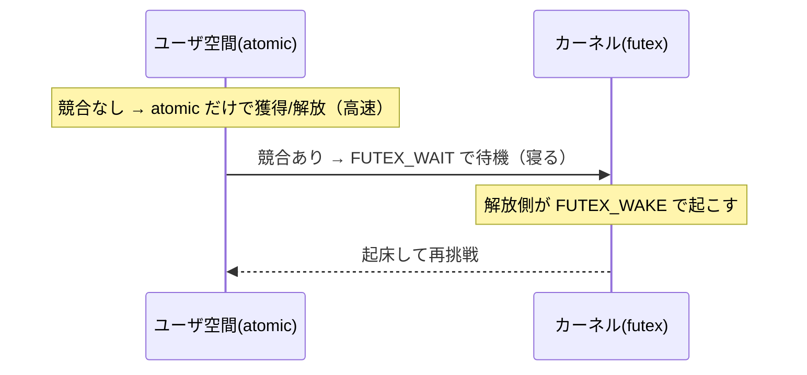
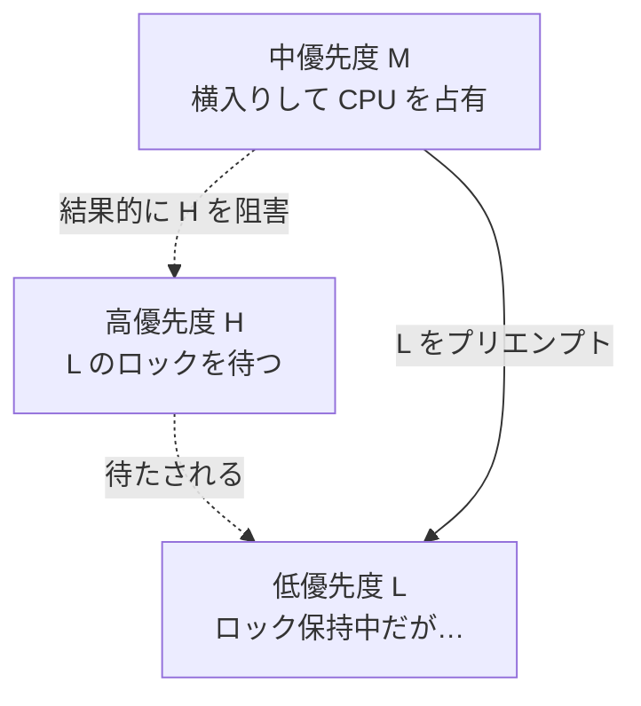

# 同期プリミティブの内側

第5章で見たとおり、複数スレッドが同じ状態を触ると壊れます。それを防ぐのが **同期プリミティブ（synchronization primitive）** です。本章では、ユーザに見える `Mutex` から、その土台にある atomic 命令まで、層を下りながら「実際どう実装されているのか」を解剖します。同期は魔法ではなく、ハードウェアの atomic 命令の上に積み上げられた工学です。

## 最下層：atomic 操作と CAS

第4章で、`counter += 1` が load・add・store の 3 ステップに分かれ、その隙間で壊れることを見ました。これを防ぐ最も基本的な道具が、**atomic（不可分）操作** です。atomic 操作は「他のスレッドから見て、操作全体が一瞬で起きたか、まだ起きていないかのどちらかにしか見えない」ことをハードウェアが保証します。中途半端な状態が観測されません。

最も重要な atomic 命令が **CAS（Compare-And-Swap、比較交換）** です。CAS は「あるメモリ番地の値が期待値と等しければ、新しい値に書き換える。等しくなければ何もしない。そして元の値（または成否）を返す」という操作を、不可分に行います。x86 では `cmpxchg`、ARM では load-linked/store-conditional（LL/SC）として提供されます。Treiber が 1986 年の報告[](#cite:treiber1986)で示したように、CAS は並行データ構造の礎です。

CAS を使うと、先ほどのカウンタを正しく増やせます。

```ruby
# atomic_cas(addr, expected, new) は擬似プリミティブとする
def atomic_increment(cell)
  loop do
    old = cell.value
    new = old + 1
    break if atomic_cas(cell, old, new)   # 誰にも邪魔されず更新できたら成功
    # 失敗 = 間に誰かが書き換えた。読み直してやり直す
  end
end
```

この「読む → 計算する → CAS で書き戻す → 失敗したらループ」というパターンは、ロックフリープログラミング（第8章）の心臓部です。誰も止めずに、衝突したときだけやり直すので **楽観的（optimistic）** な同期と呼ばれます。

> [!NOTE]
> atomic 操作には CAS のほか、`fetch_and_add`（値を読んで加算し、元の値を返す）、`exchange`（値を入れ替える）、atomic な load/store などがあります。第4章で触れた acquire/release のメモリ順序は、これら atomic 操作に付随して指定します。「atomic であること」と「順序が保証されること」は別の保証で、両方を意識する必要があります。

## spinlock：待つのではなく回す

atomic を使えば、最も単純なロックを作れます。**spinlock（スピンロック）** は、ロックが空くまで CAS をひたすら繰り返して「忙しく待つ（busy-wait）」ロックです。

```ruby
class SpinLock
  def initialize; @locked = AtomicBoolean.new(false); end

  def lock
    # false から true へ CAS できたら獲得成功。できなければ回り続ける
    until @locked.compare_and_set(false, true)
      # スピン（CPU を回しながら待つ）
    end
  end

  def unlock
    @locked.set(false)   # release セマンティクスで解放
  end
end
```

spinlock は、ロックを保持する時間がごく短く、待ち時間が「他コアで数命令」程度なら効率的です。OS に制御を渡さず、コンテキストスイッチのコストを避けられるからです。しかし保持時間が長いと、待っているコアが無駄に CPU を焼き続けます。さらに、待っているスレッドと保持しているスレッドが同じコアに割り当てられると、保持側が走れず誰も進めない最悪の事態（特にシングルコアやオーバーサブスクリプション時）も起きます。

> [!WARNING]
> 素朴な spinlock は、ロック変数を全コアが激しく CAS し合うため、キャッシュコヒーレンシのトラフィック（第2章）で性能が崩壊することがあります。実用的な実装は、CAS の前にまず通常 load で「空いていそうか」を確認する（test-and-test-and-set）、待ち時間に応じて待機を伸ばす（指数バックオフ）、といった工夫を加えます。

## futex：ユーザ空間とカーネルの良いとこ取り

spinlock は短い待ちには良いが長い待ちに弱い。逆に「待つときは OS に寝かせてもらう」純粋なカーネルロックは、競合がないときでもシステムコールのコストがかかります。この両者を折衷するのが **futex（fast userspace mutex）** です。Linux で Franke らが導入しました[](#cite:franke2002)。

futex の発想はこうです。

1. **競合がない普通のとき**：ロックの獲得・解放はユーザ空間の atomic 操作だけで完結する。カーネルに入らないので速い。
2. **競合したときだけ**：`futex` システムコールで「この番地の値が X の間、寝かせてくれ（FUTEX_WAIT）」とカーネルに頼み、解放側が「この番地で寝ている奴を起こせ（FUTEX_WAKE）」と頼む。



「競合がない限りカーネルに入らない」という設計は、現代の高速なロックの定石です。Linux 上の pthread mutex やほとんどの言語の mutex は、内部的に futex（や同等の機構）の上に作られています。

## mutex：相互排他の標準形

**mutex（mutual exclusion、相互排他ロック）** は、ユーザが最もよく使う同期プリミティブです。「同時に 1 スレッドしか保持できない」ロックで、保持している間はクリティカルセクション（critical section、同時に 1 スレッドしか入れない区間）を独占できます。

```ruby
mutex = Mutex.new
counter = 0

threads = 10.times.map do
  Thread.new do
    100_000.times do
      mutex.synchronize { counter += 1 }   # ここは一度に1スレッド
    end
  end
end
threads.each(&:join)
puts counter   # => 1_000_000（今度は正しい）
```

第5章で値がずれたカウンタが、mutex で囲うと正しくなります。mutex の `lock` は acquire、`unlock` は release のセマンティクスを持つので、第4章の happens-before の鎖が張られ、保護した変数の更新が他スレッドから正しく見えます。

mutex は spinlock と futex を組み合わせて作られるのが普通です。「まず少しスピンして、それでも取れなければ futex で寝る」というハイブリッド（適応的 mutex）が、短い競合にも長い競合にも対応します。

> [!CAUTION]
> mutex は **デッドロック（deadlock）** を生みます。スレッド A がロック X を持って Y を待ち、B が Y を持って X を待つと、互いに永久に待ち続けます。Dijkstra が「deadly embrace（死の抱擁）」と呼んだ現象です[](#cite:dijkstra1968)。回避の定石は「ロックを取る順序を全スレッドで統一する」ことです。処理系の実装者として複数のロックを持つときは、ロックの順序規約を文書化し、必ず守ってください。

## 条件変数：状態の変化を待つ

mutex は「区間の排他」を提供しますが、「ある条件が成り立つまで待つ」用途には向きません。素朴にループで条件をチェックし続けると、ロックを握ったまま回り続けて誰も状態を変えられなくなります。これを解くのが **条件変数（condition variable）** です。

条件変数は mutex と組で使い、「条件が成立するまでロックを手放して寝る（`wait`）」「条件を変えた側が起こす（`signal` / `broadcast`）」という協調を提供します。生産者・消費者のキューが典型例です。

```ruby
class BoundedQueue
  def initialize(max)
    @max = max; @items = []
    @mutex = Mutex.new
    @not_full  = ConditionVariable.new
    @not_empty = ConditionVariable.new
  end

  def push(x)
    @mutex.synchronize do
      @not_full.wait(@mutex) while @items.size >= @max  # 満杯なら空くまで寝る
      @items.push(x)
      @not_empty.signal   # 「空でなくなった」と消費者を起こす
    end
  end

  def pop
    @mutex.synchronize do
      @not_empty.wait(@mutex) while @items.empty?       # 空なら入るまで寝る
      x = @items.shift
      @not_full.signal    # 「満杯でなくなった」と生産者を起こす
      x
    end
  end
end
```

> [!IMPORTANT]
> 条件のチェックは `if` ではなく **`while`** で行うのが鉄則です。`wait` から起こされても、起きた瞬間にはまだ条件が成り立っていないことがある（別スレッドに先を越された、あるいは根拠なく起こされる **spurious wakeup**）からです。起きたら必ず条件を再確認する、という規律が並行プログラムの正しさを支えます。もうひとつ、条件となる状態は必ず mutex で守ります。`wait` は「mutex を放して眠りに入る」までを不可分に行うので、「条件を確認した直後・眠る直前に通知が来て、それを永遠に取りこぼす」**lost wakeup** が防がれます。状態は共有変数に持たせ、条件変数は「状態が変わったかもしれない」という合図にすぎない——この役割分担が肝心です。

## 生存性（liveness）の落とし穴

ここまでの道具は「同時に壊さない」という **安全性（safety、悪いことが起きない）** を守るためのものでした。しかし同期にはもう一つの軸があります。**生存性（liveness、良いことがいつかは起きる）**——プログラムが止まらず、待っている仕事がいつかは前に進む、という保証です。安全性は満たしているのに前に進めなくなる障害は、真の並列がなくても、スケジューリングとインターリーブだけで起こります。代表的な 4 つを押さえましょう。

**デッドロック（deadlock）** は、複数のスレッドが互いの持つロックを待ち合い、誰も進めなくなる状態です。mutex の節で見たとおり、回避の定石は「ロック獲得順序を全スレッドで統一する」ことでした。

**ライブロック（livelock）** は、スレッドたちが「譲り合い」を繰り返し、状態は変化し続けるのに誰も前進しないことです。狭い廊下で対面した二人が、互いに同じ側へ避けてはぶつかる、を繰り返す状況に似ています。ロックフリーのリトライ（第8章）で、衝突を検知して全員が一斉にやり直すと、また衝突して全員やり直す……と空回りするのが典型です。デッドロックと違い CPU は回り続けるため、一見「動いている」ように見えてしまう厄介さがあります。対策は、譲り合いに**ランダムな間隔**を入れる（指数バックオフ）など、対称性を崩すことです。

**飢餓（starvation）** は、一部のスレッドだけがいつまでもロックを取れず、仕事が進まない状態です。これは **公平性（fairness）** の欠如から生じます。たとえば素朴な reader-writer ロックで、読み手が次々に来続けると、書き手が永久に割り込めません（writer starvation）。先に待ち始めた者が先に獲得できる **公平なロック**（ticket lock のように待ち行列を作る方式）にすれば飢餓は防げますが、その分スループットは落ちることがあります。「速い（不公平）」と「飢えない（公平）」はしばしばトレードオフです。

**優先度逆転（priority inversion）** は、優先度の高いスレッドが、低いスレッドの持つロックを待たされる現象です。



ロックを持った低優先度 L が、無関係な中優先度 M に CPU を奪われて走れず、その結果 L が握ったロックを待つ高優先度 H までもが進めなくなります。1997 年の火星探査機 Mars Pathfinder が再起動を繰り返した原因として有名です。対策が **優先度継承（priority inheritance）**——ロックを持つ間だけ、待っている最高優先度を一時的に引き継いで M に割り込まれないようにする——で、多くの RTOS や pthread の mutex が `PTHREAD_PRIO_INHERIT` として備えています。

> [!WARNING]
> 安全性のバグ（データ競合）は「壊れたデータ」として現れますが、生存性のバグは「止まった／一部だけ遅れるプログラム」として現れ、再現も切り分けも難しいものです。とくに飢餓や優先度逆転は、低負荷のテストでは顔を出さず、本番の高負荷時だけ表面化しがちです。検出と再現の手立ては第19章で扱います。

## 層の全体像

本章で下りてきた層を、上から並べると次のようになります。

| 層 | 抽象度 | 実体 |
|----|--------|------|
| 条件変数 / mutex | ユーザが使う | OS スレッド API・futex の上 |
| futex | カーネルとユーザの境界 | システムコール＋atomic |
| spinlock | 純ユーザ空間 | atomic 命令のループ |
| CAS / atomic | ハードウェア命令 | `cmpxchg`、LL/SC |
| キャッシュコヒーレンシ | ハードウェア | MESI など（第2章） |

言語処理系の実装者は、ユーザにはこの一番上（mutex・条件変数や、もっと高水準のチャネル）を見せつつ、内部実装ではもっと下の層を直接使い分けます。

> [!TIP]
> 「正しさ」のためにはこの章の道具で十分ですが、「スケーラビリティ」のためには不十分なことがあります。ロックは本質的に直列化点を作るので、コア数が増えると競合が性能の壁になります。次章では、ロックそのものを使わずに正しさを保つ **ロックフリー** の世界へ進みます。
