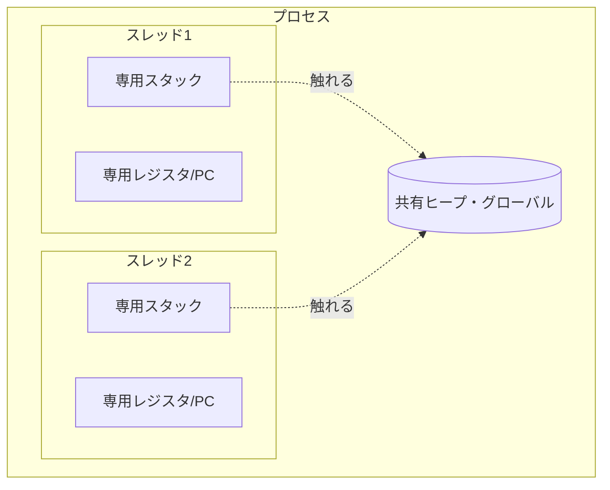
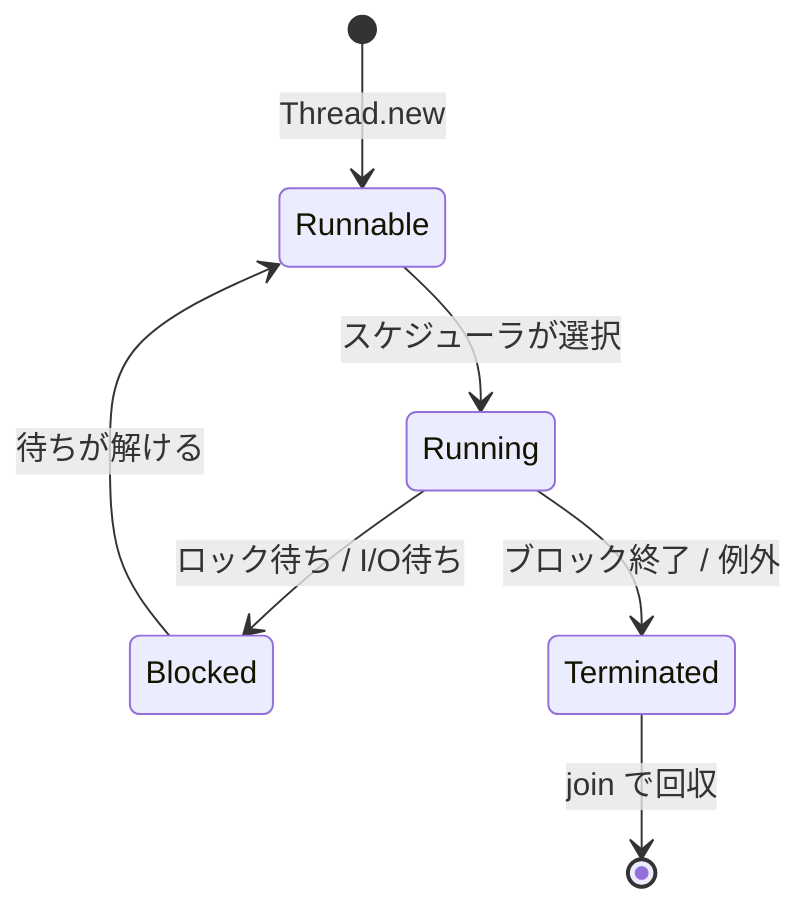

# スレッドを言語機能にする

第II部の最初の課題は、最も基本的な並列の単位である **スレッド（thread）** を言語機能として提供することです。ユーザが「この処理を別のスレッドで走らせる」「そのスレッドの終了を待つ」と書けるようにし、その下でランタイムがスタックや実行状態を管理する——その全体像を本章で組み立てます。

## プロセスとスレッド

まず用語を整理します。**プロセス（process）** は、OS が割り当てる独立したメモリ空間（アドレス空間）を持つ実行単位です。プロセス間ではメモリは共有されません。一方 **スレッド（thread）** は、1 つのプロセスの中で複数走る実行の流れで、**同じアドレス空間（ヒープ、グローバル変数）を共有** します。各スレッドが固有に持つのは、プログラムカウンタ（次に実行する命令の位置）、レジスタの値、そして **スタック** です。



「ヒープは共有、スタックは専用」というこの分割が、第4章で見たデータ競合の温床になります。スタック上のローカル変数は基本的に安全ですが、ヒープ上の共有オブジェクトは同期なしに触ると壊れます。

## pthreads：C 言語処理系の足場

多くの言語処理系は C で書かれ、OS スレッドの上に自分のスレッドを載せます。UNIX 系での OS スレッドの標準 API が **POSIX threads（pthreads）** です。言語処理系の実装者は、たとえ自前の高水準スレッド API をユーザに見せるとしても、その内部では pthreads（や Windows のスレッド API）を直接叩くことになります。だからその基本は押さえておく必要があります。

スレッドの生成と join は次の形です。

```c
#include <pthread.h>

void *worker(void *arg) {
    long id = (long)arg;
    /* このスレッドで行う仕事 */
    return (void *)(id * 2);   /* 戻り値を返せる */
}

int main(void) {
    pthread_t t;
    pthread_create(&t, NULL, worker, (void *)42);  /* スレッド開始 */
    void *result;
    pthread_join(t, &result);   /* 終了を待ち、戻り値を受け取る */
    return 0;
}
```

`pthread_create` は新しいスレッドを生成し、指定した関数を走らせます。`pthread_join` はそのスレッドの終了を待ち、戻り値を回収します。join しないまま放置するとリソースがリークするため、`pthread_detach` で「join しない（終了時に自動回収する）」と明示する方法もあります。

pthreads が提供するのはスレッドだけではありません。本書の後の章で扱う同期プリミティブの多くも pthreads の一部です。

| API | 役割 | 関連する章 |
|-----|------|-----------|
| `pthread_create` / `pthread_join` | スレッドの生成・終了待ち | 本章 |
| `pthread_mutex_t` | 相互排他ロック | 第7章 |
| `pthread_cond_t` | 条件変数 | 第7章 |
| `pthread_key_create` / `pthread_getspecific` | スレッドローカル記憶（TLS） | 本章後半 |
| `pthread_once` | 一度だけの初期化 | 第14章 |

> [!IMPORTANT]
> pthreads の API は「正しく使えば正しく動く」だけで、誤用を防いではくれません。ロックの取り忘れ、`join` 忘れ、初期化前のアクセスなどは、すべて静かに未定義動作につながります。言語処理系の役割のひとつは、この生々しい API を、ユーザが誤りにくい高水準の抽象（後述の `Thread` クラスや、第10章の構造化並行性）で包むことです。

### スレッドスタックのサイズと数の制約

pthreads で見落としがちなのが **スタックサイズ** です。各 OS スレッドには固定サイズ（典型的には 1〜8 MB）のスタックが割り当てられます。これは 2 つの制約を生みます。第一に、深い再帰はスタックオーバーフローを起こします。第二に、**スレッドをたくさん作れない** という制約です。1 スレッドあたり 1 MB として、10,000 スレッドで 10 GB——現実的でありません。「接続ごとに 1 スレッド」のようなモデルが OS スレッドでは破綻するのはこのためで、第10章の軽量スレッドが生まれた直接の動機になります。

## スレッドを言語の `Thread` クラスにする

C の生 API を、ユーザに見せる言語機能へ昇華させましょう。Ruby の `Thread` を模した API を考えます。

```ruby
t = Thread.new(10) do |n|
  sum = (1..n).sum   # 別スレッドで計算
  sum                # ブロックの戻り値がスレッドの値になる
end

result = t.join.value   # 終了を待って結果を得る
puts result             # => 55
```

処理系の実装者として、この `Thread.new` の裏で起きることを整理します。

1. **VM 実行状態の用意**：新しいスレッド専用のオペランドスタック・フレームスタック（第5章の Tiny VM で言えば新しい `@stack`）を確保する。
2. **OS スレッドの生成**：`pthread_create` で OS スレッドを作り、その上で渡されたブロックを VM が実行する。
3. **スレッドオブジェクトの登録**：処理系が全スレッドを把握できるよう、グローバルなスレッドリストに登録する（GC やシグナル処理で全スレッドを止める必要があるため。第13・15章）。
4. **戻り値・例外の受け渡し**：ブロックの戻り値や、途中で発生した例外を、`join` した側へ安全に渡す。

> [!NOTE]
> 「全スレッドを処理系が把握しておく」点は地味ですが重要です。Stop-the-world GC（第13章）はすべてのスレッドを安全な地点で止める必要があり、シグナル処理（第15章）も全スレッドへの配慮が要ります。スレッドを言語機能にするとは、生成 API を足すだけでなく、ランタイム全体がスレッドの集合を管理する責務を負うことです。

## join とライフサイクル

`join` は「相手スレッドの終了を待つ」操作で、第4章の用語で言えば happens-before の鎖を張る同期点です。`t.join` が返った後では、`t` の中で行われたすべての書き込みが、join した側から確実に見えます。これは「結果を安全に受け取る」ための保証です。

スレッドの一生は、おおむね次の状態を遷移します。



例外の扱いは設計判断が分かれます。Ruby ではデフォルトで、子スレッドで起きた例外は join 時に親へ再送出されます。「黙って死なせる」より「join した人に知らせる」方が、バグを見逃しにくい設計です。第10章の構造化並行性は、この「子の失敗を親が確実に拾う」考え方をさらに徹底します。

## スレッドローカル記憶（TLS）

すべてを共有すると壊れるなら、「このスレッドだけが見える領域」が欲しくなります。それが **スレッドローカル記憶（thread-local storage, TLS）** です。同じ変数名・キーでも、スレッドごとに別の実体を持ちます。

```ruby
Thread.current[:request_id] = "abc-123"   # このスレッド固有
# 別スレッドから Thread.current[:request_id] を見ても nil
```

TLS は処理系の内部実装でも多用されます。たとえば「現在実行中の VM コンテキストへのポインタ」「スレッドごとのアロケータの空きリスト（第13章）」「例外処理の途中状態」などをスレッドローカルに置くことで、ロックなしに高速アクセスできます。共有しないことが最速の同期だ、という発想の最も基本的な形です。

> [!TIP]
> 「グローバルに見えるが実はスレッドごと」という TLS は強力ですが、使いすぎると暗黙の状態が増えて見通しが悪くなります。ライブラリ作者が TLS にコンテキストを隠すと、第10章の軽量スレッドや非同期処理で「タスクがスレッドを移ったら値が消えた」という落とし穴を生みます。Java の仮想スレッド（第20章）が scoped values を別途用意したのは、この問題への回答です。

## 本章のまとめ

- スレッドはヒープを共有しスタックを専有する。共有部分がデータ競合の温床になる。
- C 処理系の足場は pthreads。生成・join に加え、ミューテックスや TLS も pthreads が提供する。
- OS スレッドは固定サイズのスタックを持ち、大量には作れない。これが第10章の軽量スレッドの動機。
- 言語の `Thread` 機能の実装は、生成 API だけでなく、VM 実行状態の用意・全スレッド管理・戻り値と例外の受け渡しを含む。
- TLS は「共有しない」ことで安全と速度を得る基本手段。

スレッドを用意したら、次に必要なのはスレッド間の **同期** です。次章では、`Thread` の下で動く同期プリミティブ——atomic、CAS、spinlock、futex、mutex、条件変数——を上から下へ掘り下げます。
