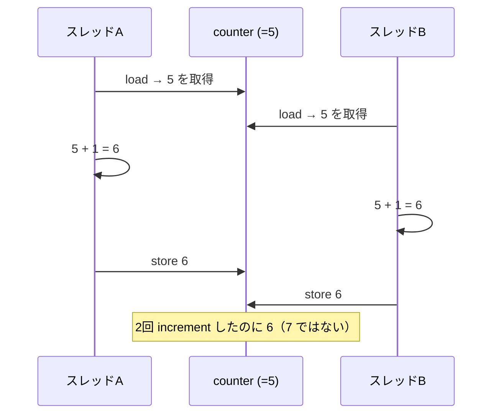

# 題材：極小インタプリタとデータ競合の体験

ここまで概念を積み上げてきました。本章では、本書を通じて繰り返し参照する **極小インタプリタ** を Ruby で実装し、そこに実際にデータ競合を踏ませてみます。手を動かして「壊れる」のを見ることが、以降の章で何を守ろうとしているのかを理解する近道だからです。

## 極小スタックマシン「Tiny VM」

題材として、スタックベースの小さな仮想マシン（VM）を使います。命令列を受け取り、内部スタックを操作しながら実行する、ごく単純な処理系です。多くの実用言語処理系（CRuby の YARV、CPython、JVM など）もスタックマシンを基礎にしているので、本物の縮図になっています。

```ruby
class TinyVM
  def initialize
    @stack = []
    @globals = {}   # グローバル変数表（処理系の共有状態の縮図）
  end

  # program: 命令の配列。各命令は [opcode, *operands]
  def run(program)
    pc = 0
    while pc < program.size
      op, *args = program[pc]
      case op
      when :push   then @stack.push(args[0])
      when :add    then b, a = @stack.pop, @stack.pop; @stack.push(a + b)
      when :store  then @globals[args[0]] = @stack.pop
      when :load   then @stack.push(@globals[args[0]])
      when :print  then puts @stack.last
      end
      pc += 1
    end
    @stack.last
  end
end

vm = TinyVM.new
# (1 + 2) を計算して x に入れ、x を表示する
vm.run([[:push, 1], [:push, 2], [:add], [:store, :x], [:load, :x], [:print]])
# => 3
```

この VM には、後の章で問題になる要素が凝縮されています。**オペランドスタック `@stack`** はスレッドの実行状態（第6章のスタック管理）の縮図で、**グローバル変数表 `@globals`** は処理系が抱える共有状態（第12章）の縮図です。逐次実行する限り、これは何の問題もなく正しく動きます。

## 共有して走らせると壊れる

では、この VM の上で「カウンタを増やす」プログラムを、複数スレッドで同時に走らせてみましょう。`@globals[:counter]` を読み、1 を足し、書き戻す、という典型的な read-modify-write です。

```ruby
INC = [
  [:load, :counter],   # counter を読む
  [:push, 1],
  [:add],              # +1
  [:store, :counter],  # 書き戻す
]

vm = TinyVM.new
vm.run([[:push, 0], [:store, :counter]])  # counter = 0

threads = 10.times.map do
  Thread.new do
    100_000.times { vm.run(INC) }   # 同じ VM を共有して回す
  end
end
threads.each(&:join)

vm.run([[:load, :counter], [:print]])
# 期待値: 1_000_000
# 実際:   毎回違う、たいてい 1_000_000 より小さい値
```

期待値は 100,000 × 10 = 1,000,000 です。しかし実際に走らせると、たいてい **それより小さい、毎回異なる値** が出ます。`@stack` も `@globals` も複数スレッドが同時に触っているので、二重に壊れています。

> [!NOTE]
> CRuby（標準の Ruby 処理系）には GVL（第16章）があり、ネイティブな意味での並列実行は制限されます。それでも上の例で値が合わないのは、`load → add → store` という複数バイトコードの **途中で別スレッドに切り替わる** ためです。GVL は「1 つのバイトコードの粒度」では割り込みを防いでも、「複数バイトコードからなる論理操作」の不可分性は守りません。これは GVL があっても並行バグから自由ではない、という第16章の伏線です。

## なぜ値が失われるのか

失われる仕組みを、2 スレッドのインターリーブで追ってみます。`counter` が 5 のとき、A と B が同時に increment しようとしたとします。



A と B の両方が「5」を読んでから、それぞれ「6」を書き戻しています。本来 2 回増えて 7 になるべきところが 6 になり、1 回分の更新が **失われた更新（lost update）** になります。これが increment が「アトミックでない（不可分でない）」ことの正体です。`counter += 1` という一行が、機械語レベルでは load・add・store の 3 ステップに分かれ、その隙間に他スレッドが割り込めるのです。

## スタックの破壊：もっと深刻な壊れ方

カウンタの値がずれるのはまだ「データが間違う」だけです。`@stack` を共有した場合はもっと深刻で、**処理系そのものがクラッシュ** し得ます。A が `pop` した直後に B も `pop` し、空の配列から取り出そうとして `nil` が紛れ込み、`nil + 1` で例外になる——といった具合です。

ユーザコードのバグではなく、**処理系の内部状態が壊れている** ことに注意してください。実行スタックは処理系が握る最も基本的な状態であり、これがスレッド間で共有されてはいけません。第6章では、スレッドごとに独立したスタックを持たせる設計を扱います。

> [!CAUTION]
> ここで「壊れ方」が 2 種類あったことを覚えておいてください。(1) 答えが間違う（lost update）、(2) 処理系がクラッシュする（不変条件の破壊）。並列化のバグは、軽い前者だけでなく、メモリ破壊やクラッシュに直結する後者を含みます。だからこそ第III部で処理系内部を一つひとつ点検します。

## いちおうの応急処置と、その不満

最も素朴な対処は、VM 全体を 1 つのロックで囲うことです。

```ruby
require 'monitor'

class TinyVM
  def initialize
    @stack = []; @globals = {}
    @lock = Monitor.new
  end

  def run(program)
    @lock.synchronize do   # 1度に1スレッドしか入れない
      # ...（中身は同じ）...
    end
  end
end
```

これで値は正しく 1,000,000 になります。しかし代償は大きい。`@lock.synchronize` の中には一度に 1 スレッドしか入れないので、**せっかく複数コアがあっても実質的に逐次実行に戻ってしまう** からです。これはまさに第16章で扱う GIL/GVL の縮図です。「全体を 1 つのロックで守る」のは正しさの面では簡単ですが、並列性を捨てています。

本書の残りは、この不満——「正しく、かつ並列に動かしたい」——にどう応えるかの長い旅です。第II部では、ロックの粒度を細かくする、ロックを使わない、そもそも共有しない、といった選択肢を順に検討します。第III部では、ユーザに見えないところで `@globals` や `@stack` に相当する処理系の共有状態をどう作り直すかを扱います。

> [!TIP]
> この Tiny VM は手元で実際に動かせます。スレッド数や反復回数を変え、ロックあり・なしで結果と実行時間がどう変わるかを観察してみてください。「壊れる」「遅くなる」を体感しておくと、以降の章の動機がはっきりします。第5章のこの題材は、第18章（データ競合検出）でもう一度、検出ツールにかける対象として再登場します。

これで第I部は終わりです。並行と並列の区別、ハードウェアの前提、モデルの地図、メモリモデル、そして実際に壊れる体験——並列処理系を作るための土台が揃いました。第II部からは、いよいよこれを「正しく、速く」するための言語機能を実装していきます。
